# TouchSpin Modern Architecture

This document explains the implemented modern modular architecture of TouchSpin and how to use it.

## Architecture Overview

```mermaid
graph TB
    %% Three-Stage Evolution Overview
    subgraph "Three-Stage TouchSpin Evolution"
        subgraph "Stage 1: TRUE Legacy (v3.x, 873 lines)"
            L_JQ["jQuery Plugin<br/>$.fn.TouchSpin"]
            L_Core["Monolithic Core<br/>(Hardcoded Bootstrap)"]
            L_HTML["Hardcoded HTML<br/>Templates"]
            
            L_JQ --> L_Core
            L_Core --> L_HTML
        end
        
        subgraph "Stage 2: In-Between (v4.x, 1,502 lines)"
            M_JQ["jQuery Plugin<br/>$.fn.TouchSpin + Commands"]
            M_Core["Enhanced Monolithic Core<br/>(Renderer System)"]
            M_Renderer["RendererFactory<br/>(Bootstrap 3/4/5)"]
            
            M_JQ --> M_Core
            M_Core --> M_Renderer
        end
        
        subgraph "Stage 3: New Modular (v5.x, ~300 lines/pkg)"
            subgraph "packages/core/"
                N_Core["TouchSpinCore<br/>(Framework Agnostic)"]
                N_Abstract["AbstractRenderer<br/>(Base Class)"]
                N_Factory["Factory Functions<br/>(TouchSpin, getTouchSpin)"]
            end
            
            subgraph "packages/jquery-plugin/"
                N_JQ["jQuery Wrapper<br/>(Optional Bridge)"]
            end
            
            subgraph "packages/renderers/"
                N_BS5["Bootstrap5Renderer"]
                N_BS4["Bootstrap4Renderer"]
                N_BS3["Bootstrap3Renderer"]
                N_TW["TailwindRenderer"]
            end
        end
    end
    
    %% Modern Architecture Detail
    subgraph "Modern Architecture Components"
        subgraph "Core Package"
            Core["TouchSpinCore"]
            Events["Event System<br/>(Native)"]
            Settings["Settings Management<br/>(Sanitization)"]
            API["Public API<br/>(Methods & Events)"]
            
            Core --> Events
            Core --> Settings
            Core --> API
        end
        
        subgraph "Renderer Package"
            Renderer["AbstractRenderer"]
            BS_Renderers["Bootstrap Renderers<br/>(3, 4, 5)"]
            TW_Renderer["Tailwind Renderer"]
            Custom["Custom Renderers<br/>(Extensible)"]
            
            Renderer --> BS_Renderers
            Renderer --> TW_Renderer
            Renderer --> Custom
        end
        
        subgraph "jQuery Package"
            Wrapper["jQuery Wrapper"]
            Bridge["Event Bridge<br/>(Core → jQuery)"]
            Compat["Compatibility Layer<br/>(Command API)"]
            
            Wrapper --> Bridge
            Wrapper --> Compat
        end
    end
    
    %% External Dependencies
    subgraph "External Dependencies"
        jQuery_Lib["jQuery<br/>(Optional)"]
        Bootstrap["Bootstrap CSS<br/>(3, 4, or 5)"]
        Tailwind_CSS["Tailwind CSS<br/>(Alternative)"]
        Browser["Browser APIs<br/>(DOM, Events)"]
        Custom_CSS["Custom CSS<br/>(Framework)"]
    end
    
    %% Application Integration
    subgraph "Application Layer"
        User_App["User Application"]
        Tests["Test Suite<br/>(Unit & Integration)"]
        Examples["Demo Pages<br/>(All Frameworks)"]
    end
    
    %% Modern Architecture Relationships
    N_JQ --> N_Factory
    N_Factory --> N_Core
    N_Core --> N_Abstract
    N_Abstract --> N_BS5
    N_Abstract --> N_BS4
    N_Abstract --> N_BS3
    N_Abstract --> N_TW
    
    %% Modern Component Relationships
    Wrapper --> Core
    Core --> Renderer
    Renderer --> BS_Renderers
    Renderer --> TW_Renderer
    
    %% External Dependencies
    N_JQ -.-> jQuery_Lib
    N_BS5 -.-> Bootstrap
    N_BS4 -.-> Bootstrap
    N_BS3 -.-> Bootstrap
    N_TW -.-> Tailwind_CSS
    Custom -.-> Custom_CSS
    N_Core --> Browser
    
    %% Application Integration
    User_App --> N_Factory
    User_App --> N_JQ
    Tests --> Core
    Tests --> Renderer
    Examples --> N_Factory
    
    %% Evolution Flow
    L_JQ -.->|"v3→v4<br/>Added Commands"| M_JQ
    M_JQ -.->|"v4→v5<br/>Modular Rewrite"| N_JQ
    L_Core -.->|"Enhanced"| M_Core
    M_Core -.->|"Separated"| N_Core
    L_HTML -.->|"Abstracted"| M_Renderer
    M_Renderer -.->|"Modularized"| N_BS5
    
    %% Key Architectural Benefits
    subgraph "Key Benefits of Modern Architecture"
        Benefit1["✅ Framework Agnostic Core"]
        Benefit2["✅ Full Unit Test Coverage"]
        Benefit3["✅ Pluggable Renderers"]
        Benefit4["✅ Backward Compatibility"]
        Benefit5["✅ Tree-Shakable Modules"]
        Benefit6["✅ Modern JavaScript Patterns"]
    end
    
    %% Styling
    classDef legacyStyle fill:#ffebee,stroke:#c62828,stroke-width:2px
    classDef intermediateStyle fill:#fff3e0,stroke:#ef6c00,stroke-width:2px
    classDef modernStyle fill:#e8f5e8,stroke:#2e7d32,stroke-width:2px
    classDef coreStyle fill:#e3f2fd,stroke:#1565c0,stroke-width:2px
    classDef rendererStyle fill:#fce4ec,stroke:#c2185b,stroke-width:2px
    classDef wrapperStyle fill:#f3e5f5,stroke:#7b1fa2,stroke-width:2px
    classDef benefitStyle fill:#e0f2f1,stroke:#00695c,stroke-width:2px
    
    %% Apply styles
    class L_JQ,L_Core,L_HTML legacyStyle
    class M_JQ,M_Core,M_Renderer intermediateStyle
    class N_Core,N_Abstract,N_Factory,Core,Events,Settings,API modernStyle
    class N_BS5,N_BS4,N_BS3,N_TW,Renderer,BS_Renderers,TW_Renderer,Custom rendererStyle
    class N_JQ,Wrapper,Bridge,Compat wrapperStyle
    class Benefit1,Benefit2,Benefit3,Benefit4,Benefit5,Benefit6 benefitStyle
```



This diagram illustrates the complete three-stage evolution of TouchSpin and the modern modular architecture.

### Three-Stage Evolution

**Stage 1 (TRUE Legacy):** Simple monolithic jQuery plugin with hardcoded Bootstrap HTML templates.

**Stage 2 (In-Between):** Enhanced monolithic structure with renderer system for multi-Bootstrap support and command API.

**Stage 3 (New Modular):** Complete architectural rewrite with framework-agnostic core and pluggable renderers.

### Modern Architecture Components

**Core Package (`packages/core/`):**
- Framework-agnostic business logic
- Native event system
- Comprehensive settings sanitization
- Public API for methods and events

**Renderer Package (`packages/renderers/`):**
- Pluggable rendering system
- Bootstrap 3/4/5 support
- Tailwind CSS support
- Extensible for custom frameworks

**jQuery Package (`packages/jquery-plugin/`):**
- Optional backward compatibility
- Event bridging from core to jQuery
- Command API compatibility layer

### Key Architectural Benefits

1. **Framework Agnostic Core** - Use with any CSS framework
2. **Full Unit Test Coverage** - Test individual components in isolation
3. **Pluggable Renderers** - Easy to add new framework support
4. **Backward Compatibility** - Existing jQuery code continues to work
5. **Tree-Shakable Modules** - Only load what you need
6. **Modern JavaScript Patterns** - Clean, maintainable code structure

### Integration Points

**For jQuery Users:**
```javascript
$('#spinner').TouchSpin({min: 0, max: 100}); // Still works
```

**For Modern Applications:**
```javascript
const api = TouchSpin('#spinner', {min: 0, max: 100}); // Clean API
```

**For Framework Integration:**
```javascript
const core = new TouchSpinCore(element, settings);
const renderer = new CustomRenderer(element, settings, core);
```

This architecture enables TouchSpin to serve both legacy applications requiring jQuery compatibility and modern applications needing framework-agnostic components.

## Package Structure ✅ **IMPLEMENTED**

### 1. Core Engine ✅ (`packages/core/`)

**Location**: `packages/core/src/index.js`  
**Role**: Framework-agnostic business logic  
**Dependencies**: None (pure JavaScript)

```javascript
// Core responsibilities:
- Value pipeline: _nextValue, _forcestepdivisibility, _alignToStep  
- State management: disabled/readonly checks, boundary detection
- Event emission: 'min', 'max', 'startspin', 'stopspin'  
- Settings management: updateSettings, validation
- Callback processing: before/after calculation hooks
```

**API**:
```javascript  
import { createPublicApi } from '../../packages/core/src/index.js';

const api = createPublicApi(inputElement, { min: 0, max: 100, step: 1 });
api.upOnce();           // Increment value
api.getValue();         // Get current value  
api.setValue(50);       // Set value programmatically
api.on('max', handler); // Listen to boundary events
```

### 2. Renderers ✅ (`packages/renderers/`)

**Implemented Packages**:
- `@touchspin/renderer-bootstrap3` (`packages/renderers/renderer-bootstrap3/`)
- `@touchspin/renderer-bootstrap4` (`packages/renderers/renderer-bootstrap4/`) 
- `@touchspin/renderer-bootstrap5` (`packages/renderers/renderer-bootstrap5/`)
- `@touchspin/renderer-tailwind` (`packages/renderers/renderer-tailwind/`)

**Role**: Handle DOM manipulation and framework-specific markup

```javascript
// Renderer responsibilities:
- DOM structure creation (input groups, buttons)
- Framework-specific classes (Bootstrap, Tailwind)
- Event binding (mousedown, touchstart, keyboard)  
- ARIA attributes and accessibility
- Visual styling and layout
```

### 3. jQuery Wrapper ✅ (`packages/jquery-plugin/`)

**Location**: `packages/jquery-plugin/src/index.js`  
**Role**: Provides jQuery API and backwards compatibility  

```javascript
// Wrapper provides jQuery integration:
- $.fn.TouchSpin() registration
- $input.data('touchspin') and $input.data('touchspinInternal')
- jQuery event emission (touchspin.on.min, change, etc.)
- Command API: $(input).TouchSpin('setValue', 50)
- 100% backwards compatibility with original plugin
```

### 4. Framework Wrappers ✅ **IMPLEMENTED** / 🔄 **PLANNED**

- `@touchspin/web-component`: Standards-based custom element
- `@touchspin/react`: React component wrapper (planned)
- `@touchspin/angular`: Angular component wrapper (planned)

## Data Flow

```
User Interaction → Renderer → Core → Wrapper → Framework Events
                    ↓         ↓      ↓
                   DOM      Logic   API
```

**Step-by-step flow**:
1. **User clicks button** → Renderer captures `mousedown` event  
2. **Renderer calls core** → `core.upOnce()` or `core.downOnce()`
3. **Core processes** → value calculation, validation, boundary checks
4. **Core emits events** → 'change', 'min', 'max' with new value
5. **Wrapper listens** → converts to framework events (`$input.trigger('change')`)
6. **Application code** → receives familiar framework events

## Usage Examples

### Modern Modular Approach (Current Implementation)

```html
<!DOCTYPE html>
<html>
<head>
  <script src="https://cdn.jsdelivr.net/npm/jquery@3.7.1/dist/jquery.min.js"></script>
  <link href="https://cdn.jsdelivr.net/npm/bootstrap@5.3.2/dist/css/bootstrap.min.css" rel="stylesheet">
  
  <!-- Import the jQuery plugin with a specific renderer -->
  <script type="module">
    import { installWithRenderer } from '@touchspin/jquery-plugin';
    import Bootstrap5Renderer from '@touchspin/renderer-bootstrap5';
    installWithRenderer(Bootstrap5Renderer);
  </script>
</head>
<body>
  <input id="demo" type="text" value="50">
  
  <script>
    // Same familiar API!
    $("#demo").TouchSpin({ min: 0, max: 100 });
  </script>
</body>
</html>
```

### Original Approach (Legacy Compatibility)

```html  
<!DOCTYPE html>
<html>
<head>
  <script src="jquery.min.js"></script>
  <link href="bootstrap.min.css" rel="stylesheet">
  
  <!-- Single monolithic file -->
  <script src="../../src/jquery.touchspin.js"></script>
</head>
<body>
  <input id="demo" type="text" value="50">
  
  <script>
    $("#demo").TouchSpin({ min: 0, max: 100 });
  </script>
</body>
</html>
```

### Future Development: React Component

```jsx
import { TouchSpin } from '@touchspin/react';

function MyComponent() {
  const [value, setValue] = useState(50);
  
  return (
    <TouchSpin 
      min={0} 
      max={100}
      value={value}
      onChange={setValue}
      renderer="bootstrap4"
    />
  );
}
```

## Benefits of Modern Architecture

### 1. **Framework Independence** ✅
- Core logic works with any framework (React, Vue, Angular, vanilla JS)
- Only wrapper layer is framework-specific
- Easy to create new framework integrations

### 2. **CSS Framework Flexibility** ✅  
- Single core + different renderers for Bootstrap 3/4/5, Tailwind, etc.
- Add new CSS frameworks without touching business logic
- Consistent behavior across all visual styles

### 3. **Bundle Size Optimization** ✅
- Import only what you need: core + specific renderer
- Tree shaking eliminates unused code  
- No jQuery required for modern framework implementations

### 4. **Enhanced Testability** ✅
- Core logic tested independently of DOM
- Renderer behavior tested separately
- TDD approach ensures behavioral parity (10/10 tests passing)
- Integration tests verify complete stack

### 5. **Maintainability** ✅
- Clear separation of concerns
- Single responsibility principle  
- Easier to debug and extend
- Framework updates don't affect core logic

## Backwards Compatibility ✅

The jQuery wrapper ensures **100% API compatibility** with the original plugin:

```javascript
// All original APIs still work:
$(input).TouchSpin({ min: 0, max: 100 });
$(input).TouchSpin('getValue');  
$(input).TouchSpin('setValue', 75);
$(input).TouchSpin('upOnce');
$(input).TouchSpin('destroy');

// Data access methods:
$(input).data('touchspin').upOnce();
$(input).data('touchspinInternal').getValue();

// Event handling:
$(input).on('touchspin.on.max', handler);
$(input).on('change', handler);
```

## Testing Architecture ✅

**TDD Behavioral Parity**: 10/10 tests passing comparing original vs modern implementations

```javascript
// Comprehensive Test Coverage:
✅ Basic increment/decrement behavior
✅ Programmatic API (getValue, setValue, upOnce)  
✅ Boundary behavior (min/max constraints)
✅ Disabled input behavior
✅ Readonly input behavior
✅ Event emission patterns  
✅ Callback formatting with currency
✅ Modern core unit tests (disabled/readonly, events, step alignment)
```

**Test Types**:
- **Unit Tests**: Core logic, individual renderers, framework wrappers
- **Integration Tests**: Original vs Modern behavior, cross-framework consistency  
- **End-to-End Tests**: Real browser interactions, accessibility, performance

## Implementation Status

- ✅ **Core Engine**: Fully implemented and tested
- ✅ **Renderers**: Bootstrap 3/4/5 and Tailwind implemented  
- ✅ **jQuery Wrapper**: Complete with 100% backwards compatibility
- ✅ **Web Component**: Fully implemented and tested
- ✅ **TDD Parity**: 10/10 behavioral parity tests passing
- ✅ **Documentation**: Architecture and usage documented
- ✅ **Build System**: UMD bundles and ESM exports (implemented)
- 🔄 **Framework Wrappers**: React, Vue, Angular (planned)

This architecture provides a solid foundation for long-term maintainability while ensuring seamless migration from the original monolithic plugin.

