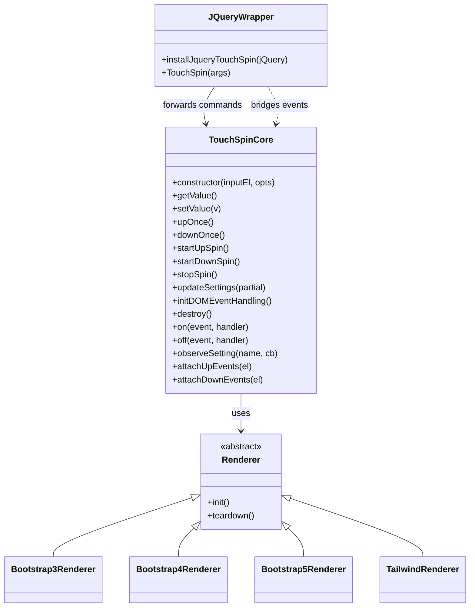
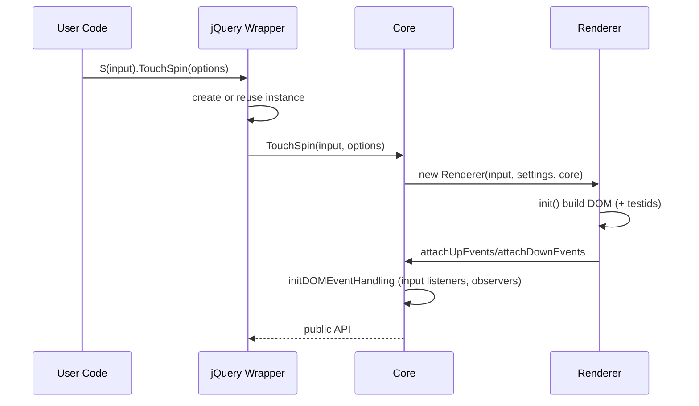
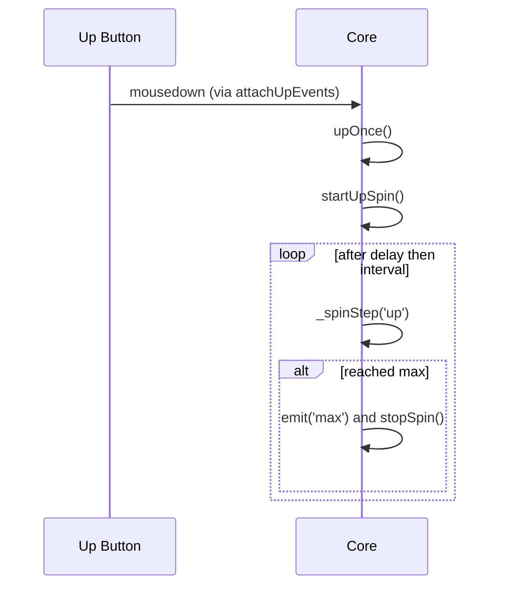
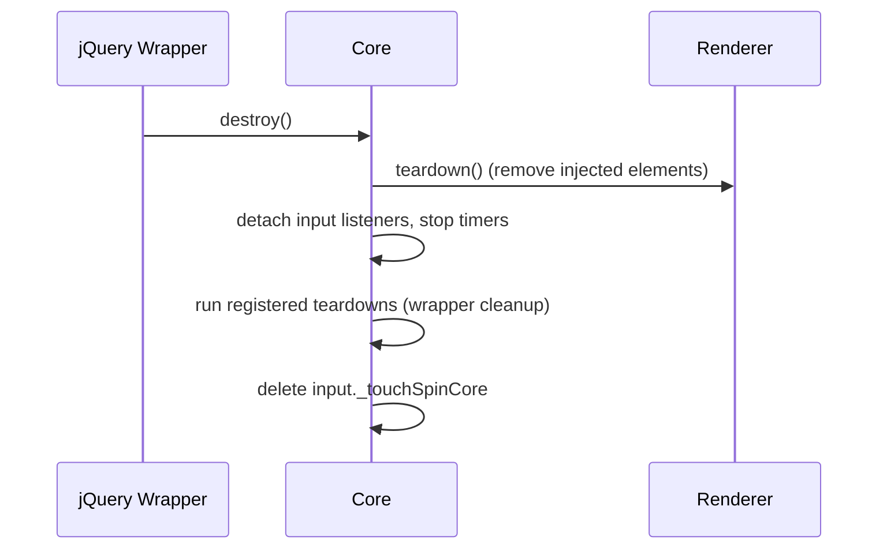

# Bootstrap TouchSpin — Consolidated Architecture Guide

This guide consolidates the strongest parts of both analyses in `architecture-claude/` and `architecture-openai/` into a single, developer‑focused reference. It emphasizes the current modular architecture (v5) and how to extend it. For historical evolution details, see `HISTORY.md` in this folder.

## Scope and Principles

- Focus: current v5 modular design and developer extension points.
- Tests: the project intentionally uses end‑to‑end Playwright tests only (no unit tests). That fits architectural rewrites by validating behavior, not implementation.
- Metrics: do not treat line count as a quality signal. The new architecture has more lines due to JSDoc, modular separation, and clearer organization.

## High‑Level Architecture

- Core (`packages/core/`): framework‑agnostic logic and state. Owns value math, constraints, ARIA, native attribute sync, spin timers, event emission, and settings observers.
- jQuery wrapper (`packages/jquery-plugin/`): thin bridge to core. Forwards commands, forwards core events to jQuery events, manages teardown for its own bridges. Contains no DOM event logic.
- Renderers (`packages/renderers/*`): framework‑specific DOM presentation (Bootstrap 3/4/5, Tailwind). Build markup, add required data attributes, and call `core.attachUpEvents`/`attachDownEvents`.

### Class Diagram

### Initialization Sequence

## Responsibilities and Contracts

- Core: single source of truth for state and behavior.
  - Value math and constraints: min/max, step, decimals, divisibility modes, boosted steps, alignment.
  - Spin lifecycle: `startUpSpin`/`startDownSpin`/`stopSpin` with delay/interval and boundary stops.
  - Event emission: min/max, start/stop variants, boostchange.
  - Input handling: capture phase interception of native `change`, blur/Enter sanitization, native `change` dispatch on real changes.
  - Accessibility: `aria-valuenow`/`aria-valuetext` updates, button labels.
  - Native attribute sync: sync min/max/step only for `type="number"` inputs.
  - Observers: `observeSetting(name, cb)` to support reactive renderer updates.
  - Element attachment: `attachUpEvents(el)` / `attachDownEvents(el)`; renderers call these after building DOM.

- jQuery wrapper: API surface and event bridge only.
  - Installs `$.fn.TouchSpin` with init/command branching and forwards to the core instance.
  - Bridges core events to jQuery: `touchspin.on.min/max/startspin/...`.
  - Registers teardown to unhook any wrapper‑level listeners when `destroy()` is called.
  - Does not attach DOM event listeners to buttons or input; core handles events via data roles.

- Renderers: framework presentation and roles.
  - Build or augment the input group using the target framework’s patterns.
  - Add data roles: `data-touchspin-injected="wrapper|up|down|prefix|postfix"` (and `vertical-wrapper` when relevant).
  - Add deterministic testids from `data-testid="{id}"`: `{id}-wrapper|up|down|prefix|postfix`.
  - Call `core.attachUpEvents/attachDownEvents` for created buttons.
  - React to setting changes via `core.observeSetting` for prefix/postfix text/classes and vertical buttons.
  - Implement `teardown()` to remove injected elements cleanly.

## Event Model and Timing

- Core → jQuery wrapper event names:
  - `min` → `touchspin.on.min`
  - `max` → `touchspin.on.max`
  - `startspin` → `touchspin.on.startspin`
  - `startupspin` → `touchspin.on.startupspin`
  - `startdownspin` → `touchspin.on.startdownspin`
  - `stopupspin` → `touchspin.on.stopupspin`
  - `stopdownspin` → `touchspin.on.stopdownspin`
  - `stopspin` → `touchspin.on.stopspin`
  - `boostchange` → `touchspin.on.boostchange` (payload: `{ level, step, capped }`)

- Emission order guarantees:
  - Spin start: `startspin` then `startupspin`/`startdownspin`.
  - Boundary events: when a single step hits the exact boundary, emit `min|max` BEFORE setting the display value; holding stops immediately on boundary.
  - Spin end: directional `stop*` then `stopspin`.
  - Native `change`: dispatched only when display actually changes; intermediate unsanitized changes are intercepted in capture.

### Hold/Spin Sequence

## Options and Data Attributes

- min/max: numbers or null (unbounded). Native min/max also influence settings and are synced for `type="number"`.
- step: >0; divisibility modes `round|floor|ceil|none` affect formatting, not physics.
- decimals: ≥0 display precision.
- stepinterval / stepintervaldelay: hold timing.
- booster / boostat / maxboostedstep: accelerated stepping on hold with cap.
- mousewheel: active while input is focused.
- prefix/postfix (+ extra classes): visual affordances; renderers update reactively.
- verticalbuttons (+ labels/classes): renderer‑specific visuals; core only attaches events.
- initval / replacementval / firstclickvalueifempty: helpers for empty values.

## Behavioral Guarantees (Modern Core)

- Proactive boundary prevention: spin cannot start at a boundary; single steps at a boundary are no‑ops.
- Boundary event ordering: `min|max` fire before display changes when the target equals the boundary.
- Boost escalation: `2^⌊spincount/boostat⌋ * step` with optional cap by `maxboostedstep`; values align to the boosted grid when capped.
- Sanitization gates native `change`: intermediate values are not emitted; sanitized values dispatch native `change` only when they differ.
- Native attribute sync restricted to `type="number"` inputs to avoid unintended browser behaviors.

## Extending the System

### Build a Custom Renderer

1) Implement a class with `init()` and `teardown()`.
2) Construct markup, assign `data-touchspin-injected` roles, and add derived testids.
3) Call `core.attachUpEvents(buttonUp)` / `core.attachDownEvents(buttonDown)`.
4) Subscribe to `core.observeSetting` for prefix/postfix and other reactive updates.
5) Ensure buttons’ focusability follows `focusablebuttons` (tabindex / ARIA labels).

### Wrap the Core for Another Framework (e.g., Angular)

- Instantiate via a directive/component; keep a reference to the returned API.
- Translate framework events to the core API and re‑emit as needed (or surface the core API directly).
- Provide a teardown hook that calls `api.destroy()` when the component unmounts.
- Avoid attaching DOM listeners directly; rely on the core and renderer data roles.

## Testing Strategy (E2E Only)

- The repository only uses Playwright tests by design: they validate public behavior across renderers and wrappers.
- Test selectors use deterministic testids derived from `data-testid` on the input: `{id}-wrapper|up|down|prefix|postfix`.
- The `npm run inspect <path> [json|text]` script can auto‑start the dev server on port 8866 and report console/page/network errors plus TouchSpin init status for diagnostics.

## Destroy/Teardown

## Where to Go Next

- See `HISTORY.md` for the three‑stage architectural evolution and migration notes.
- See `packages/core/` and `packages/renderers/*` for concrete implementations to reference when building your own renderers or wrappers.

