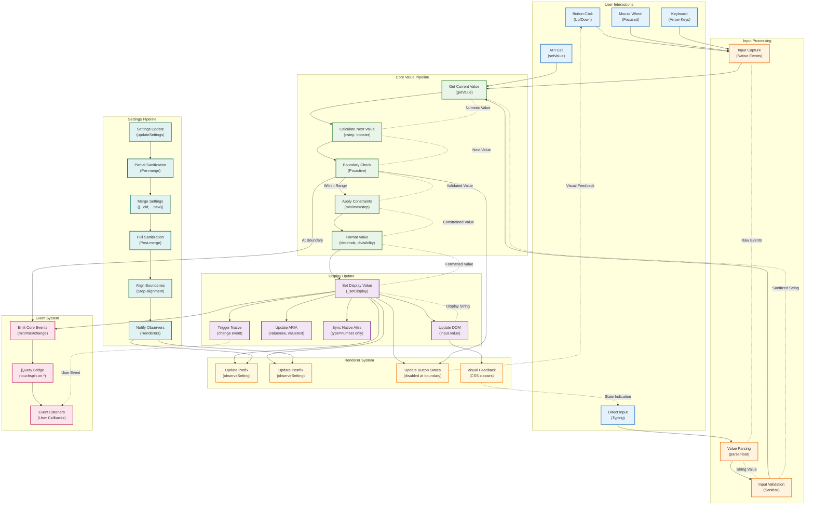

## Data Flow Explanation

This diagram shows how data flows through the TouchSpin system from user input to display update.

### Primary Data Paths

**1. User Interaction → Display Update**
- User clicks button or types value
- Input captured and parsed
- Core pipeline processes value
- Display updated with new value

**2. API Call → Display Update**
- External code calls `setValue()`
- Value goes through constraint pipeline
- Display updated if value changed

**3. Settings Update → Renderer Update**
- Settings changed via `updateSettings()`
- Sanitization and validation applied
- Observers notified of changes
- Renderers update visual elements

### Key Processing Stages

**Input Processing:**
- Raw input captured from various sources
- String values parsed to numbers
- Basic validation and sanitization

**Core Value Pipeline:**
- Current value retrieved
- Next value calculated (with booster logic)
- Proactive boundary checking
- Constraints applied (min/max/step)
- Value formatted for display

**Event System:**
- Core events emitted at key points
- jQuery bridge translates to legacy events
- User callbacks invoked

**Display System:**
- Input field value updated
- ARIA attributes updated for accessibility
- Native attributes synced (type="number" only)
- Native change event triggered

**Renderer Integration:**
- Visual elements updated (prefix/postfix)
- Button states managed (disabled at boundaries)
- CSS classes applied for feedback

### Data Validation Points

**1. Input Validation**
- String sanitization
- Number parsing
- Basic format checks

**2. Boundary Validation (Proactive)**
- Check before operation
- Prevent unnecessary calculations
- Emit boundary events

**3. Constraint Application**
- Min/max enforcement
- Step alignment
- Decimal precision

**4. Settings Sanitization**
- Pre-merge partial validation
- Post-merge full validation
- Boundary alignment
- Observer notification

### Event Flow

**Core Events:**
- `change` - Value changed
- `min`/`max` - Boundary reached
- `startspin`/`stopspin` - Spinning state
- `boostchange` - Acceleration changed

**jQuery Bridge Events:**
- `touchspin.on.change`
- `touchspin.on.min`/`touchspin.on.max`
- `touchspin.on.startspin`/`touchspin.on.stopspin`

### Feedback Loops

**Visual Feedback:**
- Button states reflect current boundaries
- CSS classes indicate spinner state
- ARIA attributes provide accessibility info

**Event Feedback:**
- Native change events trigger user handlers
- Button visual feedback affects user interaction
- State indication guides user behavior

This data flow ensures consistent, predictable behavior while maintaining separation of concerns between input processing, core logic, event handling, and display management.