```mermaid
sequenceDiagram
    participant User as User Code
    participant Factory as TouchSpin Factory
    participant Core as TouchSpinCore
    participant Renderer as Renderer (BS5/etc)
    participant DOM as DOM Elements
    participant Events as Event System
    
    Note over User,Events: Modern API Initialization
    
    %% Modern Initialization Flow
    User->>Factory: TouchSpin('#input', options)
    
    Factory->>Factory: Check for existing instance
    alt Instance exists and no options
        Factory-->>User: Return existing API
    else Instance exists with new options
        Factory->>Core: destroy() existing instance
        Core->>DOM: Remove event listeners
        Core->>DOM: Clean up DOM elements
        Core->>Core: Clear instance reference
    end
    
    Factory->>Factory: sanitizeSettings(options)
    Note right of Factory: Comprehensive validation:<br/>step>0, decimals≥0,<br/>min/max null or finite
    
    Factory->>Core: new TouchSpinCore(input, settings)
    activate Core
    
    Core->>Core: Initialize properties
    Core->>Core: Set up event emitter
    Core->>DOM: Store instance reference
    Note right of DOM: inputEl[INSTANCE_KEY] = core
    
    Core->>Core: _parseDataAttributes()
    Note right of Core: Parse data-bts-* attributes
    
    Core->>Core: _initializeValue()
    Core->>Core: Apply initval if input empty
    Core->>Core: _checkValue(false) - sanitize
    
    Factory->>Factory: Select renderer based on settings
    Factory->>Renderer: new RendererClass(input, settings, core)
    activate Renderer
    
    Renderer->>Renderer: Initialize renderer properties
    Renderer->>DOM: Create wrapper elements
    Renderer->>DOM: Build button structure
    Renderer->>DOM: Add CSS classes
    Renderer->>DOM: Set data attributes for core targeting
    Note right of DOM: data-touchspin-injected="up|down|wrapper"
    
    Renderer->>DOM: Apply prefix/postfix if specified
    Renderer->>DOM: Set testid attributes for testing
    Note right of DOM: data-testid="spinner-up|down|wrapper"
    
    Renderer->>Core: attachUpEvents(upButton, behavior)
    Core->>DOM: addEventListener('mousedown', upHandler)
    Core->>DOM: addEventListener('mouseup', stopHandler)
    Core->>DOM: addEventListener('mouseleave', stopHandler)
    
    Renderer->>Core: attachDownEvents(downButton, behavior)
    Core->>DOM: addEventListener('mousedown', downHandler)
    Core->>DOM: addEventListener('mouseup', stopHandler)
    Core->>DOM: addEventListener('mouseleave', stopHandler)
    
    Core->>DOM: Setup input event listeners
    Core->>DOM: addEventListener('input', _handleInputChange)
    Core->>DOM: addEventListener('blur', _handleInputBlur)
    Core->>DOM: addEventListener('keydown', _handleKeydown)
    
    alt mousewheel enabled
        Core->>DOM: addEventListener('wheel', _handleWheel)
    end
    
    Core->>Core: _initMutationObserver()
    Core->>DOM: Observe attribute changes
    Note right of DOM: Watch disabled, readonly,<br/>min, max, step attributes
    
    Core->>Core: _updateAriaAttributes()
    Core->>DOM: Set aria-valuenow, aria-valuemin, aria-valuemax
    
    Core->>Core: _syncNativeAttributes()
    alt input type="number"
        Core->>DOM: Sync min/max/step to native attrs
    else input type="text"
        Note right of Core: Skip native sync to avoid<br/>browser formatting conflicts
    end
    
    Renderer->>Core: observeSetting(key, callback)
    Note right of Core: Register for setting change notifications
    
    deactivate Renderer
    
    Factory->>Factory: Create public API wrapper
    Factory->>Core: Register teardown callback for cleanup
    
    deactivate Core
    
    Factory-->>User: Return public API object
    
    Note over User,Events: jQuery Wrapper Initialization (Compatibility)
    
    User->>User: $('#input').TouchSpin(options)
    User->>Factory: Delegate to TouchSpin factory
    
    Note over Factory: Same initialization as above
    
    Factory->>Factory: Create jQuery event bridge
    Factory->>Events: Bridge core events to jQuery events
    
    Events->>Events: Map 'change' → 'touchspin.on.change'
    Events->>Events: Map 'min' → 'touchspin.on.min'
    Events->>Events: Map 'max' → 'touchspin.on.max'
    Events->>Events: Map 'startspin' → 'touchspin.on.startspin'
    
    Factory-->>User: Return jQuery collection (chainable)
    
    Note over User,Events: Error Handling During Initialization
    
    alt Invalid input element
        Factory->>Factory: Validate input element exists
        Factory-->>User: Throw error: Element not found
    else Invalid settings
        Factory->>Factory: sanitizeSettings() with warnings
        Note right of Factory: Correct invalid values,<br/>log warnings, continue
    else DOM manipulation fails
        Core->>Core: Try/catch around DOM operations
        Core-->>Factory: Throw initialization error
        Factory-->>User: Throw wrapped error with context
    end
    
    Note over User,Events: Post-Initialization State
    
    User->>User: Use returned API
    User->>Core: api.setValue(42)
    Core->>Core: Apply constraints and update display
    Core->>Events: Emit 'change' event
    Events-->>User: Trigger user callbacks
    
    User->>Core: api.upOnce()
    Core->>Core: Check boundary (proactive)
    alt At boundary
        Core->>Events: Emit 'max' event
        Core-->>User: Return without changing value
    else Within range
        Core->>Core: Calculate next value
        Core->>Core: Update display
        Core->>Events: Emit 'change' event
    end
```

## Initialization Sequence Explanation

This diagram shows the complete initialization process for TouchSpin, including both modern and jQuery wrapper approaches.

### Modern API Initialization

**1. Factory Function Call**
```javascript
const api = TouchSpin('#input', options);
```

**2. Instance Management**
- Check for existing instance on element
- Return existing API if no new options provided
- Destroy and recreate if new options provided

**3. Settings Sanitization**
- Comprehensive validation of all options
- Correction of invalid values with warnings
- Defensive programming approach

**4. Core Initialization**
- Create TouchSpinCore instance
- Set up native event emitter system
- Store instance reference on DOM element
- Parse data attributes from HTML

**5. Value Initialization**
- Apply `initval` if input is empty
- Sanitize initial value through constraint pipeline
- Set up initial display state

**6. Renderer Creation**
- Select appropriate renderer (Bootstrap 3/4/5, Tailwind)
- Build DOM structure with wrapper and buttons
- Add CSS classes and data attributes
- Set up testid attributes for automated testing

**7. Event Handler Setup**
- Attach button event handlers via core
- Set up input event listeners (change, blur, keydown)
- Configure mouse wheel support if enabled
- Initialize mutation observer for attribute watching

**8. Accessibility Setup**
- Configure ARIA attributes (valuenow, valuemin, valuemax)
- Sync native attributes for type="number" inputs only
- Set up screen reader compatible elements

**9. Observer Registration**
- Register renderer for setting change notifications
- Set up teardown callbacks for cleanup
- Create public API wrapper

### jQuery Wrapper Initialization

**For Backward Compatibility:**
```javascript
$('#input').TouchSpin(options);
```

- Delegates to the same modern factory function
- Creates additional jQuery event bridge
- Maps core events to jQuery events (`change` → `touchspin.on.change`)
- Returns jQuery collection for method chaining

### Error Handling

**Common Error Scenarios:**
1. **Element Not Found**: Clear error with element selector info
2. **Invalid Settings**: Sanitization with warnings, graceful degradation
3. **DOM Manipulation Failures**: Wrapped errors with initialization context

### Key Differences from Legacy Versions

**TRUE Legacy (v3.x):**
- Simple 8-step process
- Hardcoded HTML template insertion
- Basic jQuery event binding

**In-Between (v4.x):**
- Complex 15-step process
- Renderer system selection
- Enhanced event handling
- Still monolithic structure

**New Modular (v5.x):**
- Clean separation of concerns
- Dependency injection with renderer
- Comprehensive error handling
- Systematic cleanup registration

### Post-Initialization Behavior

**Immediate Usage:**
- API is fully functional after initialization
- All event handlers are active
- Boundary checking is proactive
- Settings can be updated dynamically

**Memory Management:**
- Instance stored on DOM element
- Event listeners properly registered
- Cleanup callbacks registered for teardown
- No memory leaks in normal usage

This initialization sequence ensures that TouchSpin is properly configured, all dependencies are wired correctly, and the component is ready for immediate use with full functionality and error resilience.