```mermaid
graph TB
    %% Three-Stage Evolution Overview
    subgraph "Three-Stage TouchSpin Evolution"
        subgraph "Stage 1: TRUE Legacy (v3.x, 873 lines)"
            L_JQ["jQuery Plugin<br/>$.fn.TouchSpin"]
            L_Core["Monolithic Core<br/>(Hardcoded Bootstrap)"]
            L_HTML["Hardcoded HTML<br/>Templates"]
            
            L_JQ --> L_Core
            L_Core --> L_HTML
        end
        
        subgraph "Stage 2: In-Between (v4.x, 1,502 lines)"
            M_JQ["jQuery Plugin<br/>$.fn.TouchSpin + Commands"]
            M_Core["Enhanced Monolithic Core<br/>(Renderer System)"]
            M_Renderer["RendererFactory<br/>(Bootstrap 3/4/5)"]
            
            M_JQ --> M_Core
            M_Core --> M_Renderer
        end
        
        subgraph "Stage 3: New Modular (v5.x, ~300 lines/pkg)"
            subgraph "packages/core/"
                N_Core["TouchSpinCore<br/>(Framework Agnostic)"]
                N_Abstract["AbstractRenderer<br/>(Base Class)"]
                N_Factory["Factory Functions<br/>(TouchSpin, getTouchSpin)"]
            end
            
            subgraph "packages/jquery-plugin/"
                N_JQ["jQuery Wrapper<br/>(Optional Bridge)"]
            end
            
            subgraph "packages/renderers/"
                N_BS5["Bootstrap5Renderer"]
                N_BS4["Bootstrap4Renderer"]
                N_BS3["Bootstrap3Renderer"]
                N_TW["TailwindRenderer"]
            end
        end
    end
    
    %% Modern Architecture Detail
    subgraph "Modern Architecture Components"
        subgraph "Core Package"
            Core["TouchSpinCore"]
            Events["Event System<br/>(Native)"]
            Settings["Settings Management<br/>(Sanitization)"]
            API["Public API<br/>(Methods & Events)"]
            
            Core --> Events
            Core --> Settings
            Core --> API
        end
        
        subgraph "Renderer Package"
            Renderer["AbstractRenderer"]
            BS_Renderers["Bootstrap Renderers<br/>(3, 4, 5)"]
            TW_Renderer["Tailwind Renderer"]
            Custom["Custom Renderers<br/>(Extensible)"]
            
            Renderer --> BS_Renderers
            Renderer --> TW_Renderer
            Renderer --> Custom
        end
        
        subgraph "jQuery Package"
            Wrapper["jQuery Wrapper"]
            Bridge["Event Bridge<br/>(Core → jQuery)"]
            Compat["Compatibility Layer<br/>(Command API)"]
            
            Wrapper --> Bridge
            Wrapper --> Compat
        end
    end
    
    %% External Dependencies
    subgraph "External Dependencies"
        jQuery_Lib["jQuery<br/>(Optional)"]
        Bootstrap["Bootstrap CSS<br/>(3, 4, or 5)"]
        Tailwind_CSS["Tailwind CSS<br/>(Alternative)"]
        Browser["Browser APIs<br/>(DOM, Events)"]
        Custom_CSS["Custom CSS<br/>(Framework)"]
    end
    
    %% Application Integration
    subgraph "Application Layer"
        User_App["User Application"]
        Tests["Test Suite<br/>(Unit & Integration)"]
        Examples["Demo Pages<br/>(All Frameworks)"]
    end
    
    %% Modern Architecture Relationships
    N_JQ --> N_Factory
    N_Factory --> N_Core
    N_Core --> N_Abstract
    N_Abstract --> N_BS5
    N_Abstract --> N_BS4
    N_Abstract --> N_BS3
    N_Abstract --> N_TW
    
    %% Modern Component Relationships
    Wrapper --> Core
    Core --> Renderer
    Renderer --> BS_Renderers
    Renderer --> TW_Renderer
    
    %% External Dependencies
    N_JQ -.-> jQuery_Lib
    N_BS5 -.-> Bootstrap
    N_BS4 -.-> Bootstrap
    N_BS3 -.-> Bootstrap
    N_TW -.-> Tailwind_CSS
    Custom -.-> Custom_CSS
    N_Core --> Browser
    
    %% Application Integration
    User_App --> N_Factory
    User_App --> N_JQ
    Tests --> Core
    Tests --> Renderer
    Examples --> N_Factory
    
    %% Evolution Flow
    L_JQ -.->|"v3→v4<br/>Added Commands"| M_JQ
    M_JQ -.->|"v4→v5<br/>Modular Rewrite"| N_JQ
    L_Core -.->|"Enhanced"| M_Core
    M_Core -.->|"Separated"| N_Core
    L_HTML -.->|"Abstracted"| M_Renderer
    M_Renderer -.->|"Modularized"| N_BS5
    
    %% Key Architectural Benefits
    subgraph "Key Benefits of Modern Architecture"
        Benefit1["✅ Framework Agnostic Core"]
        Benefit2["✅ Full Unit Test Coverage"]
        Benefit3["✅ Pluggable Renderers"]
        Benefit4["✅ Backward Compatibility"]
        Benefit5["✅ Tree-Shakable Modules"]
        Benefit6["✅ Modern JavaScript Patterns"]
    end
    
    %% Styling
    classDef legacyStyle fill:#ffebee,stroke:#c62828,stroke-width:2px
    classDef intermediateStyle fill:#fff3e0,stroke:#ef6c00,stroke-width:2px
    classDef modernStyle fill:#e8f5e8,stroke:#2e7d32,stroke-width:2px
    classDef coreStyle fill:#e3f2fd,stroke:#1565c0,stroke-width:2px
    classDef rendererStyle fill:#fce4ec,stroke:#c2185b,stroke-width:2px
    classDef wrapperStyle fill:#f3e5f5,stroke:#7b1fa2,stroke-width:2px
    classDef benefitStyle fill:#e0f2f1,stroke:#00695c,stroke-width:2px
    
    %% Apply styles
    class L_JQ,L_Core,L_HTML legacyStyle
    class M_JQ,M_Core,M_Renderer intermediateStyle
    class N_Core,N_Abstract,N_Factory,Core,Events,Settings,API modernStyle
    class N_BS5,N_BS4,N_BS3,N_TW,Renderer,BS_Renderers,TW_Renderer,Custom rendererStyle
    class N_JQ,Wrapper,Bridge,Compat wrapperStyle
    class Benefit1,Benefit2,Benefit3,Benefit4,Benefit5,Benefit6 benefitStyle
```

## Architecture Overview Explanation

This diagram illustrates the complete three-stage evolution of Bootstrap TouchSpin and the modern modular architecture.

### Three-Stage Evolution

**Stage 1 (TRUE Legacy):** Simple monolithic jQuery plugin with hardcoded Bootstrap HTML templates.

**Stage 2 (In-Between):** Enhanced monolithic structure with renderer system for multi-Bootstrap support and command API.

**Stage 3 (New Modular):** Complete architectural rewrite with framework-agnostic core and pluggable renderers.

### Modern Architecture Components

**Core Package (`packages/core/`):**
- Framework-agnostic business logic
- Native event system
- Comprehensive settings sanitization
- Public API for methods and events

**Renderer Package (`packages/renderers/`):**
- Pluggable rendering system
- Bootstrap 3/4/5 support
- Tailwind CSS support
- Extensible for custom frameworks

**jQuery Package (`packages/jquery-plugin/`):**
- Optional backward compatibility
- Event bridging from core to jQuery
- Command API compatibility layer

### Key Architectural Benefits

1. **Framework Agnostic Core** - Use with any CSS framework
2. **Full Unit Test Coverage** - Test individual components in isolation
3. **Pluggable Renderers** - Easy to add new framework support
4. **Backward Compatibility** - Existing jQuery code continues to work
5. **Tree-Shakable Modules** - Only load what you need
6. **Modern JavaScript Patterns** - Clean, maintainable code structure

### Integration Points

**For jQuery Users:**
```javascript
$('#spinner').TouchSpin({min: 0, max: 100}); // Still works
```

**For Modern Applications:**
```javascript
const api = TouchSpin('#spinner', {min: 0, max: 100}); // Clean API
```

**For Framework Integration:**
```javascript
const core = new TouchSpinCore(element, settings);
const renderer = new CustomRenderer(element, settings, core);
```

This architecture enables TouchSpin to serve both legacy applications requiring jQuery compatibility and modern applications needing framework-agnostic components.