```mermaid
flowchart TD
    subgraph "Boundary Logic Evolution"
        subgraph "TRUE Legacy (v3.x) - Reactive Inclusive"
            L_Start["User Action<br/>(upOnce/downOnce)"]
            L_Calc["Calculate Next Value<br/>(value ± step)"]
            L_Check["Boundary Check<br/>(value >= max)"]
            L_Clamp["Clamp Value<br/>(value = max)"]
            L_Event["Emit Boundary Event<br/>(touchspin.on.max)"]
            L_Display["Update Display<br/>(input.value = max)"]
            
            L_Start --> L_Calc
            L_Calc --> L_Check
            L_Check -->|"At/Beyond Boundary"| L_Clamp
            L_Check -->|"Within Range"| L_Display
            L_Clamp --> L_Event
            L_Event --> L_Display
        end
        
        subgraph "In-Between (v4.x) - Reactive Exact"
            M_Start["User Action<br/>(upOnce/downOnce)"]
            M_Calc["Calculate Next Value<br/>(value + getBoostedStep)"]
            M_Check["Boundary Check<br/>(value === max)"]
            M_Event["Emit Boundary Event<br/>(touchspin.on.max)"]
            M_Stop["Stop Spinning<br/>(if active)"]
            M_Display["Update Display<br/>(_setDisplay)"]
            
            M_Start --> M_Calc
            M_Calc --> M_Check
            M_Check -->|"Exactly At Boundary"| M_Event
            M_Check -->|"Within Range"| M_Display
            M_Event --> M_Stop
            M_Stop --> M_Display
        end
        
        subgraph "New Modular (v5.x) - Proactive Prevention"
            N_Start["User Action<br/>(upOnce/downOnce)"]
            N_Check["Proactive Check<br/>(currentValue === max)"]
            N_Event["Emit Boundary Event<br/>(emit('max'))"]
            N_StopSpin["Stop Spinning<br/>(if direction matches)"]
            N_Return["Return Early<br/>(prevent operation)"]
            N_Calc["Calculate Next Value<br/>(_nextValue('up', current))"]
            N_Display["Update Display<br/>(_setDisplay(newValue, true))"]
            
            N_Start --> N_Check
            N_Check -->|"Already At Boundary"| N_Event
            N_Check -->|"Within Range"| N_Calc
            N_Event --> N_StopSpin
            N_StopSpin --> N_Return
            N_Calc --> N_Display
        end
    end
    
    subgraph "Boundary Checking Comparison"
        subgraph "Key Differences"
            Diff1["❌ Legacy: Always calculates, then clamps"]
            Diff2["🔶 In-Between: Calculates, checks exact match"]
            Diff3["✅ Modern: Checks first, prevents calculation"]
            
            Performance1["Legacy: Wasteful calculations"]
            Performance2["In-Between: Still calculates unnecessarily"]  
            Performance3["Modern: Optimal - no wasted work"]
            
            Event1["Legacy: Events after clamping"]
            Event2["In-Between: Events after calculation"]
            Event3["Modern: Events prevent operation"]
        end
    end
    
    subgraph "Detailed Modern Boundary Logic"
        subgraph "upOnce() Implementation"
            Up_Start["upOnce() called"]
            Up_Current["currentValue = getValue()"]
            Up_MaxCheck["settings.max !== null &&<br/>currentValue === settings.max"]
            Up_EmitMax["emit('max', {value, direction: 'up'})"]
            Up_SpinCheck["this.spinning &&<br/>this.direction === 'up'"]
            Up_StopSpin["stopSpin()"]
            Up_Return["return (no value change)"]
            Up_NextVal["nextValue = _nextValue('up', current)"]
            Up_SetDisplay["_setDisplay(nextValue, true)"]
            
            Up_Start --> Up_Current
            Up_Current --> Up_MaxCheck
            Up_MaxCheck -->|"true"| Up_EmitMax
            Up_MaxCheck -->|"false"| Up_NextVal
            Up_EmitMax --> Up_SpinCheck
            Up_SpinCheck -->|"true"| Up_StopSpin
            Up_SpinCheck -->|"false"| Up_Return
            Up_StopSpin --> Up_Return
            Up_NextVal --> Up_SetDisplay
        end
        
        subgraph "downOnce() Implementation"
            Down_Start["downOnce() called"]
            Down_Current["currentValue = getValue()"]
            Down_MinCheck["settings.min !== null &&<br/>currentValue === settings.min"]
            Down_EmitMin["emit('min', {value, direction: 'down'})"]
            Down_SpinCheck["this.spinning &&<br/>this.direction === 'down'"]
            Down_StopSpin["stopSpin()"]
            Down_Return["return (no value change)"]
            Down_NextVal["nextValue = _nextValue('down', current)"]
            Down_SetDisplay["_setDisplay(nextValue, true)"]
            
            Down_Start --> Down_Current
            Down_Current --> Down_MinCheck
            Down_MinCheck -->|"true"| Down_EmitMin
            Down_MinCheck -->|"false"| Down_NextVal
            Down_EmitMin --> Down_SpinCheck
            Down_SpinCheck -->|"true"| Down_StopSpin
            Down_SpinCheck -->|"false"| Down_Return
            Down_StopSpin --> Down_Return
            Down_NextVal --> Down_SetDisplay
        end
    end
    
    subgraph "Spinning Boundary Prevention"
        subgraph "Start Spinning Prevention"
            Spin_Start["startUpSpin() called"]
            Spin_Check["Already at max boundary?"]
            Spin_Prevent["Don't start spinning"]
            Spin_Begin["Begin spinning sequence"]
            
            Spin_Start --> Spin_Check
            Spin_Check -->|"Yes"| Spin_Prevent
            Spin_Check -->|"No"| Spin_Begin
        end
        
        subgraph "During Spinning Boundary Hit"
            During_Step["Spinning step"]
            During_Check["Next value at boundary?"]
            During_Emit["Emit boundary event"]
            During_Stop["stopSpin()"]
            During_Continue["Continue spinning"]
            
            During_Step --> During_Check
            During_Check -->|"Yes"| During_Emit
            During_Check -->|"No"| During_Continue
            During_Emit --> During_Stop
        end
    end
    
    subgraph "Event Timing Guarantees"
        Timing1["Modern: Boundary events BEFORE display changes"]
        Timing2["Legacy/In-Between: Events AFTER display changes"]
        Timing3["Modern: Consistent event timing across all operations"]
        Timing4["Modern: Prevents operations rather than correcting them"]
    end
    
    %% Styling
    classDef legacyStyle fill:#ffebee,stroke:#c62828,stroke-width:2px
    classDef intermediateStyle fill:#fff3e0,stroke:#ef6c00,stroke-width:2px
    classDef modernStyle fill:#e8f5e8,stroke:#2e7d32,stroke-width:2px
    classDef improvementStyle fill:#e3f2fd,stroke:#1565c0,stroke-width:2px
    classDef preventionStyle fill:#f3e5f5,stroke:#7b1fa2,stroke-width:2px
    
    %% Apply styles
    class L_Start,L_Calc,L_Check,L_Clamp,L_Event,L_Display,Diff1,Performance1,Event1 legacyStyle
    class M_Start,M_Calc,M_Check,M_Event,M_Stop,M_Display,Diff2,Performance2,Event2 intermediateStyle
    class N_Start,N_Check,N_Event,N_StopSpin,N_Return,N_Calc,N_Display,Diff3,Performance3,Event3 modernStyle
    class Up_Start,Up_Current,Up_MaxCheck,Up_EmitMax,Up_SpinCheck,Up_StopSpin,Up_Return,Up_NextVal,Up_SetDisplay modernStyle
    class Down_Start,Down_Current,Down_MinCheck,Down_EmitMin,Down_SpinCheck,Down_StopSpin,Down_Return,Down_NextVal,Down_SetDisplay modernStyle
    class Spin_Start,Spin_Check,Spin_Prevent,Spin_Begin,During_Step,During_Check,During_Emit,During_Stop,During_Continue preventionStyle
    class Timing1,Timing2,Timing3,Timing4 improvementStyle
```

## Boundary Handling Evolution

This diagram illustrates the critical evolution of boundary checking logic across TouchSpin's three architectural stages.

### Architecture Comparison

**TRUE Legacy (v3.x) - Reactive Inclusive:**
- Calculates new value first
- Checks if value >= boundary (inclusive)
- Clamps value to boundary after calculation
- Events fire after display update
- Wasteful: always performs calculation

**In-Between (v4.x) - Reactive Exact:**
- Calculates new value first  
- Checks if value === boundary (exact match)
- Still reactive approach
- Events fire after calculation
- Improved precision but still wasteful

**New Modular (v5.x) - Proactive Prevention:**
- Checks current value BEFORE calculation
- Prevents operation entirely at boundary
- Events fire BEFORE any value change
- Optimal performance - no wasted calculations
- Predictable behavior

### Key Behavioral Differences

**Operation Prevention:**
```javascript
// Legacy: Always tries operation, then corrects
value += step;  // Calculate first
if (value >= max) value = max;  // Then clamp

// In-Between: Calculate then check exact match  
nextValue = current + step;  // Calculate first
if (nextValue === max) { /* handle boundary */ }

// Modern: Check before operation
if (current === max) {
    emit('max');
    return; // Prevent operation entirely  
}
nextValue = current + step;  // Only if valid
```

**Event Timing:**
- **Legacy/In-Between**: Boundary events after display changes
- **Modern**: Boundary events before any changes occur
- **Benefit**: Allows event handlers to prevent or modify operations

### Spinning Prevention Logic

**Start Prevention:**
Modern TouchSpin prevents spinning from starting at boundaries:
```javascript
startUpSpin() {
    if (this.settings.max !== null && this.getValue() === this.settings.max) {
        return; // Don't start spinning at max
    }
    // ... begin spinning
}
```

**During Spinning:**
Automatically stops when boundary reached during continuous spinning:
```javascript
// In spin loop
if (nextValue === boundary) {
    this.emit('max');
    this.stopSpin();  // Stop immediately
    return;
}
```

### Performance Impact

**Legacy Approach:**
- Always performs step calculation
- Additional clamping logic required
- Multiple value assignments
- Inefficient for boundary conditions

**Modern Approach:**
- Boundary check is single comparison
- Early return prevents unnecessary work
- No value recalculation needed
- Optimal performance at boundaries

### Event Guarantees

**Modern Event Timing Guarantees:**
1. Boundary events always fire BEFORE display changes
2. Change events always fire AFTER display changes
3. Consistent timing across all operation types (click, spin, API)
4. Event sequence is predictable and testable

**Legacy Event Timing Issues:**
1. Events could fire after display already changed
2. Timing varied between different operation types
3. Event handlers couldn't prevent the operation
4. Less predictable for testing

### Implementation Details

**Modern upOnce() Logic:**
```javascript
upOnce() {
    const currentValue = this.getValue();
    
    // Proactive boundary check
    if (this.settings.max !== null && currentValue === this.settings.max) {
        this.emit('max', {value: currentValue, direction: 'up'});
        if (this.spinning && this.direction === 'up') {
            this.stopSpin();
        }
        return; // Operation prevented
    }
    
    // Safe to proceed
    const nextValue = this._nextValue('up', currentValue);
    this._setDisplay(nextValue, true);
}
```

**Modern downOnce() Logic:**
```javascript
downOnce() {
    const currentValue = this.getValue();
    
    // Proactive boundary check  
    if (this.settings.min !== null && currentValue === this.settings.min) {
        this.emit('min', {value: currentValue, direction: 'down'});
        if (this.spinning && this.direction === 'down') {
            this.stopSpin();
        }
        return; // Operation prevented
    }
    
    // Safe to proceed
    const nextValue = this._nextValue('down', currentValue);
    this._setDisplay(nextValue, true);
}
```

### Migration Considerations

**Behavioral Changes:**
- Boundary events fire earlier in the sequence
- Operations are prevented rather than corrected
- Event handlers receive consistent timing
- Spinning behavior is more predictable

**Compatibility:**
- Event names remain the same
- Event data structure unchanged
- jQuery wrapper maintains legacy event mapping
- User callbacks receive same information

This evolution represents a fundamental improvement in both performance and predictability, while maintaining full backward compatibility through the jQuery wrapper layer.