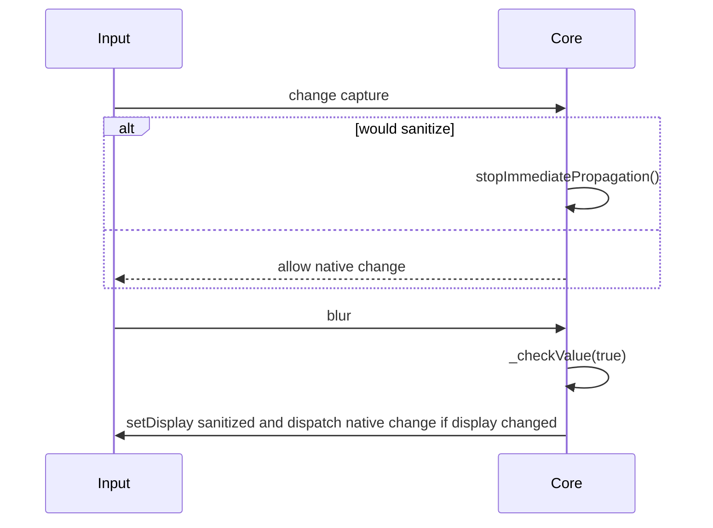

```mermaid
sequenceDiagram
  participant I as Input
  participant C as Core

  I->>C: change capture
  alt would sanitize
    C->>C: stopImmediatePropagation()
  else
    C-->>I: allow native change
  end
  I->>C: blur
  C->>C: _checkValue(true)
  C->>I: setDisplay sanitized and dispatch native change if display changed
```

