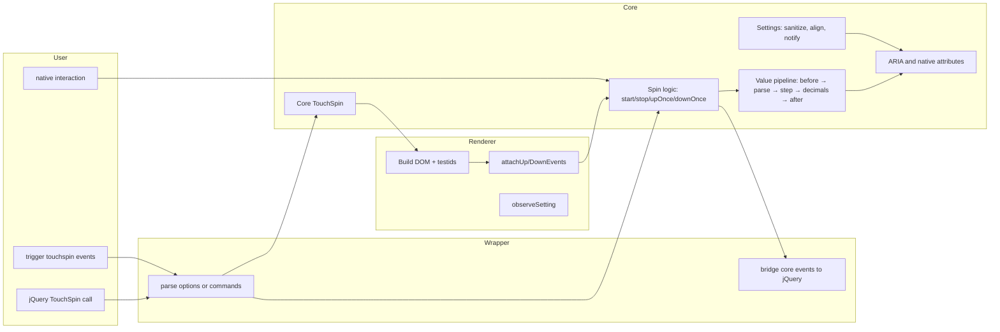

```mermaid
flowchart LR
  subgraph User
    U1[jQuery TouchSpin call]
    U2[trigger touchspin events]
    U3[native interaction]
  end

  subgraph Wrapper
    W1[parse options or commands]
    W2[bridge core events to jQuery]
  end

  subgraph Core
    C1[Core TouchSpin]
    C2[Value pipeline: before → parse → step → decimals → after]
    C3[Spin logic: start/stop/upOnce/downOnce]
    C4[Settings: sanitize, align, notify]
    C5[ARIA and native attributes]
  end

  subgraph Renderer
    R1[Build DOM + testids]
    R2[attachUp/DownEvents]
    R3[observeSetting]
  end

  U1 --> W1 --> C1 --> R1
  R1 --> R2 --> C3
  U2 --> W1 --> C3
  U3 --> C3
  C3 --> C2 --> C5
  C4 --> C5
  C3 --> W2
```

