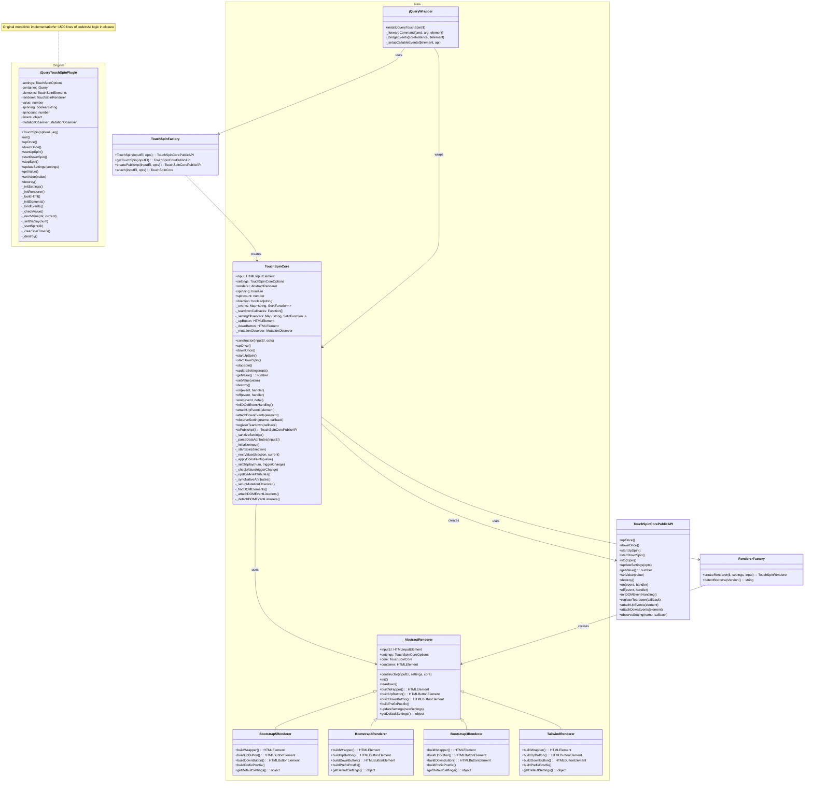

```mermaid
classDiagram
    %% Original Architecture (Monolithic)
    namespace Original {
        class jQueryTouchSpinPlugin {
            -settings: TouchSpinOptions
            -container: jQuery
            -elements: TouchSpinElements
            -renderer: TouchSpinRenderer
            -value: number
            -spinning: boolean|string
            -spincount: number
            -timers: object
            -mutationObserver: MutationObserver
            
            +TouchSpin(options, arg)
            +init()
            +upOnce()
            +downOnce()
            +startUpSpin()
            +startDownSpin()
            +stopSpin()
            +updateSettings(settings)
            +getValue()
            +setValue(value)
            +destroy()
            
            -_initSettings()
            -_initRenderer()
            -_buildHtml()
            -_initElements()
            -_bindEvents()
            -_checkValue()
            -_nextValue(dir, current)
            -_setDisplay(num)
            -_startSpin(dir)
            -_clearSpinTimers()
            -_destroy()
        }
    }

    %% New Architecture (Modular)
    namespace New {
        class TouchSpinCore {
            +input: HTMLInputElement
            +settings: TouchSpinCoreOptions
            +renderer: AbstractRenderer
            +spinning: boolean
            +spincount: number
            +direction: boolean|string
            -_events: Map~string, Set~Function~~
            -_teardownCallbacks: Function[]
            -_settingObservers: Map~string, Set~Function~~
            -_upButton: HTMLElement
            -_downButton: HTMLElement
            -_mutationObserver: MutationObserver
            
            +constructor(inputEl, opts)
            +upOnce()
            +downOnce()
            +startUpSpin()
            +startDownSpin()
            +stopSpin()
            +updateSettings(opts)
            +getValue(): number
            +setValue(value)
            +destroy()
            +on(event, handler)
            +off(event, handler)
            +emit(event, detail)
            +initDOMEventHandling()
            +attachUpEvents(element)
            +attachDownEvents(element)
            +observeSetting(name, callback)
            +registerTeardown(callback)
            +toPublicApi(): TouchSpinCorePublicAPI
            
            -_sanitizeSettings()
            -_parseDataAttributes(inputEl)
            -_initializeInput()
            -_startSpin(direction)
            -_nextValue(direction, current)
            -_applyConstraints(value)
            -_setDisplay(num, triggerChange)
            -_checkValue(triggerChange)
            -_updateAriaAttributes()
            -_syncNativeAttributes()
            -_setupMutationObserver()
            -_findDOMElements()
            -_attachDOMEventListeners()
            -_detachDOMEventListeners()
        }

        class jQueryWrapper {
            +installJqueryTouchSpin($)
            -_forwardCommand(cmd, arg, element)
            -_bridgeEvents(coreInstance, $element)
            -_setupCallableEvents($element, api)
        }

        class AbstractRenderer {
            +inputEl: HTMLInputElement
            +settings: TouchSpinCoreOptions  
            +core: TouchSpinCore
            +container: HTMLElement
            
            +constructor(inputEl, settings, core)
            +init()
            +teardown()
            +buildWrapper(): HTMLElement
            +buildUpButton(): HTMLButtonElement
            +buildDownButton(): HTMLButtonElement
            +buildPrefixPostfix()
            +updateSettings(newSettings)
            +getDefaultSettings(): object
        }

        class Bootstrap5Renderer {
            +buildWrapper(): HTMLElement
            +buildUpButton(): HTMLButtonElement  
            +buildDownButton(): HTMLButtonElement
            +buildPrefixPostfix()
            +getDefaultSettings(): object
        }

        class Bootstrap4Renderer {
            +buildWrapper(): HTMLElement
            +buildUpButton(): HTMLButtonElement
            +buildDownButton(): HTMLButtonElement  
            +buildPrefixPostfix()
            +getDefaultSettings(): object
        }

        class Bootstrap3Renderer {
            +buildWrapper(): HTMLElement
            +buildUpButton(): HTMLButtonElement
            +buildDownButton(): HTMLButtonElement
            +buildPrefixPostfix()
            +getDefaultSettings(): object
        }

        class TailwindRenderer {
            +buildWrapper(): HTMLElement
            +buildUpButton(): HTMLButtonElement
            +buildDownButton(): HTMLButtonElement
            +buildPrefixPostfix()
            +getDefaultSettings(): object
        }
    }

    %% Factory Functions
    class TouchSpinFactory {
        +TouchSpin(inputEl, opts): TouchSpinCorePublicAPI
        +getTouchSpin(inputEl): TouchSpinCorePublicAPI
        +createPublicApi(inputEl, opts): TouchSpinCorePublicAPI
        +attach(inputEl, opts): TouchSpinCore
    }

    class RendererFactory {
        +createRenderer($, settings, input): TouchSpinRenderer
        +detectBootstrapVersion(): string
    }

    %% Public API Interface
    class TouchSpinCorePublicAPI {
        +upOnce()
        +downOnce()
        +startUpSpin()
        +startDownSpin()
        +stopSpin()
        +updateSettings(opts)
        +getValue(): number
        +setValue(value)
        +destroy()
        +on(event, handler)
        +off(event, handler)
        +initDOMEventHandling()
        +registerTeardown(callback)
        +attachUpEvents(element)
        +attachDownEvents(element)
        +observeSetting(name, callback)
    }

    %% Relationships
    TouchSpinCore --> AbstractRenderer : uses
    AbstractRenderer <|-- Bootstrap5Renderer
    AbstractRenderer <|-- Bootstrap4Renderer  
    AbstractRenderer <|-- Bootstrap3Renderer
    AbstractRenderer <|-- TailwindRenderer
    
    TouchSpinCore --> TouchSpinCorePublicAPI : creates
    TouchSpinFactory --> TouchSpinCore : creates
    jQueryWrapper --> TouchSpinFactory : uses
    jQueryWrapper --> TouchSpinCore : wraps
    
    RendererFactory --> AbstractRenderer : creates
    TouchSpinCore --> RendererFactory : uses

    %% Notes about architectural transformation
    note for jQueryTouchSpinPlugin "Original monolithic implementation\n~1500 lines of code\nAll logic in closure"
```

