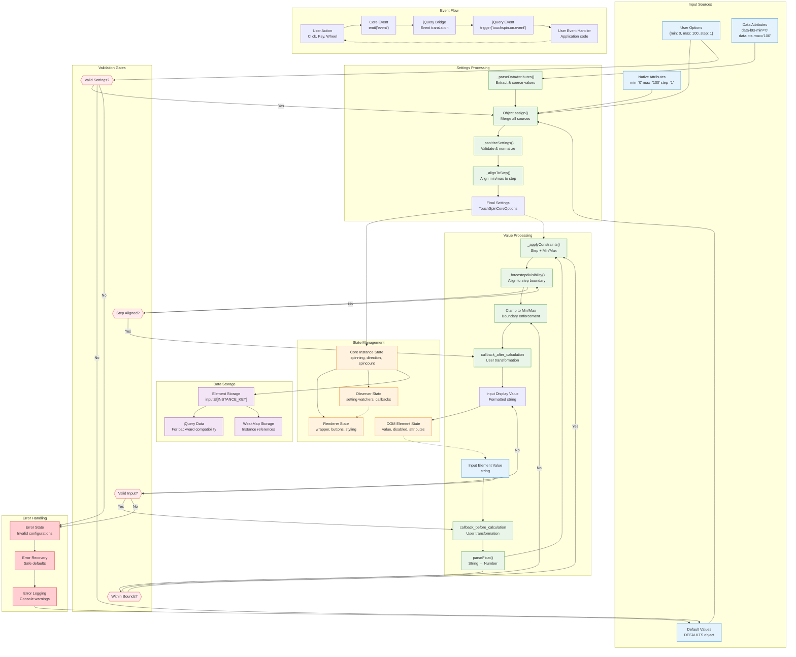

```mermaid
flowchart TD
    %% Input Sources
    subgraph "Input Sources"
        UserOptions["User Options<br/>{min: 0, max: 100, step: 1}"]
        DataAttrs["Data Attributes<br/>data-bts-min='0'<br/>data-bts-max='100'"]
        NativeAttrs["Native Attributes<br/>min='0' max='100' step='1'"]
        Defaults["Default Values<br/>DEFAULTS object"]
    end

    %% Settings Processing Pipeline
    subgraph "Settings Processing"
        ParseAttrs["_parseDataAttributes()<br/>Extract & coerce values"]
        MergeSettings["Object.assign()<br/>Merge all sources"]
        SanitizeSettings["_sanitizeSettings()<br/>Validate & normalize"]
        AlignBounds["_alignToStep()<br/>Align min/max to step"]
        FinalSettings["Final Settings<br/>TouchSpinCoreOptions"]
    end

    %% Value Processing Pipeline  
    subgraph "Value Processing"
        InputValue["Input Element Value<br/>string"]
        BeforeCallback["callback_before_calculation<br/>User transformation"]
        ParseValue["parseFloat()<br/>String → Number"]
        ApplyConstraints["_applyConstraints()<br/>Step + Min/Max"]
        ForceStep["_forcestepdivisibility()<br/>Align to step boundary"]
        ClampBounds["Clamp to Min/Max<br/>Boundary enforcement"]
        AfterCallback["callback_after_calculation<br/>User transformation"]
        DisplayValue["Input Display Value<br/>Formatted string"]
    end

    %% Event Flow
    subgraph "Event Flow"
        UserAction["User Action<br/>Click, Key, Wheel"]
        CoreEvent["Core Event<br/>emit('event')"]
        EventBridge["jQuery Bridge<br/>Event translation"]
        jQueryEvent["jQuery Event<br/>trigger('touchspin.on.event')"]
        UserCallback["User Event Handler<br/>Application code"]
    end

    %% State Management
    subgraph "State Management"
        CoreState["Core Instance State<br/>spinning, direction, spincount"]
        DOMState["DOM Element State<br/>value, disabled, attributes"]
        RendererState["Renderer State<br/>wrapper, buttons, styling"]
        ObserverState["Observer State<br/>setting watchers, callbacks"]
    end

    %% Data Persistence
    subgraph "Data Storage"
        ElementStorage["Element Storage<br/>inputEl[INSTANCE_KEY]"]
        jQueryData["jQuery Data<br/>For backward compatibility"]
        WeakMapStore["WeakMap Storage<br/>Instance references"]
    end

    %% Flow Connections - Settings
    UserOptions --> MergeSettings
    DataAttrs --> ParseAttrs
    ParseAttrs --> MergeSettings
    NativeAttrs --> MergeSettings
    Defaults --> MergeSettings
    MergeSettings --> SanitizeSettings
    SanitizeSettings --> AlignBounds
    AlignBounds --> FinalSettings

    %% Flow Connections - Value Processing
    InputValue --> BeforeCallback
    BeforeCallback --> ParseValue
    ParseValue --> ApplyConstraints
    ApplyConstraints --> ForceStep
    ForceStep --> ClampBounds
    ClampBounds --> AfterCallback
    AfterCallback --> DisplayValue

    %% Flow Connections - Events
    UserAction --> CoreEvent
    CoreEvent --> EventBridge
    EventBridge --> jQueryEvent
    jQueryEvent --> UserCallback

    %% Flow Connections - State Updates
    FinalSettings --> CoreState
    DisplayValue --> DOMState
    CoreState --> RendererState
    CoreState --> ObserverState

    %% Flow Connections - Storage
    CoreState --> ElementStorage
    ElementStorage --> jQueryData
    ElementStorage --> WeakMapStore

    %% Feedback Loops
    DOMState -.-> InputValue
    UserCallback -.-> UserAction
    ObserverState -.-> RendererState
    FinalSettings -.-> ApplyConstraints

    %% Data Validation Gates
    subgraph "Validation Gates"
        ValidateInput{{"Valid Input?"}}
        ValidateSettings{{"Valid Settings?"}}
        ValidateBounds{{"Within Bounds?"}}
        ValidateStep{{"Step Aligned?"}}
    end

    InputValue --> ValidateInput
    ValidateInput -->|Yes| BeforeCallback
    ValidateInput -->|No| DisplayValue

    UserOptions --> ValidateSettings
    ValidateSettings -->|Yes| MergeSettings
    ValidateSettings -->|No| Defaults

    ParseValue --> ValidateBounds
    ValidateBounds -->|Yes| ApplyConstraints
    ValidateBounds -->|No| ClampBounds

    ForceStep --> ValidateStep
    ValidateStep -->|Yes| AfterCallback
    ValidateStep -->|No| ForceStep

    %% Error Handling
    subgraph "Error Handling"
        ErrorState["Error State<br/>Invalid configurations"]
        ErrorRecovery["Error Recovery<br/>Safe defaults"]
        ErrorLogging["Error Logging<br/>Console warnings"]
    end

    ValidateInput -->|No| ErrorState
    ValidateSettings -->|No| ErrorState
    ErrorState --> ErrorRecovery
    ErrorRecovery --> ErrorLogging
    ErrorLogging --> Defaults

    %% Styling
    classDef input fill:#e3f2fd,stroke:#1976d2
    classDef process fill:#e8f5e8,stroke:#388e3c
    classDef state fill:#fff3e0,stroke:#f57c00
    classDef storage fill:#f3e5f5,stroke:#7b1fa2
    classDef validation fill:#ffebee,stroke:#d32f2f
    classDef error fill:#ffcdd2,stroke:#c62828

    class UserOptions,DataAttrs,NativeAttrs,Defaults,InputValue input
    class ParseAttrs,MergeSettings,SanitizeSettings,AlignBounds,BeforeCallback,ParseValue,ApplyConstraints,ForceStep,ClampBounds,AfterCallback process
    class CoreState,DOMState,RendererState,ObserverState state
    class ElementStorage,jQueryData,WeakMapStore storage
    class ValidateInput,ValidateSettings,ValidateBounds,ValidateStep validation
    class ErrorState,ErrorRecovery,ErrorLogging error
```

