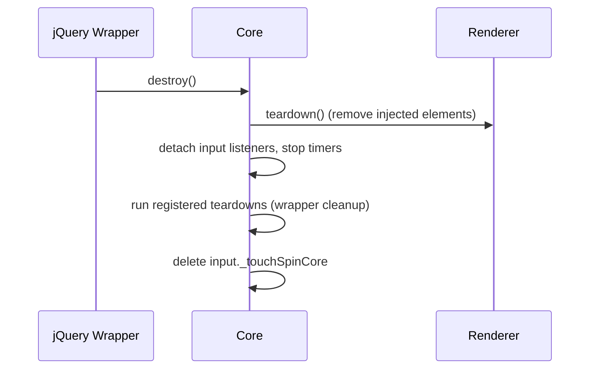

```mermaid
sequenceDiagram
  participant JQ as jQuery Wrapper
  participant C as Core
  participant R as Renderer

  JQ->>C: destroy()
  C->>R: teardown() (remove injected elements)
  C->>C: detach input listeners, stop timers
  C->>C: run registered teardowns (wrapper cleanup)
  C->>C: delete input._touchSpinCore
```

