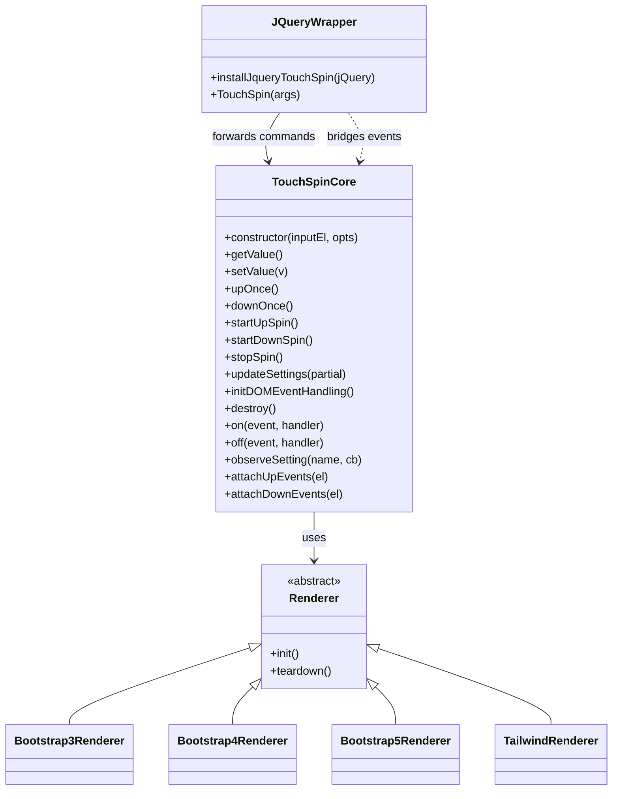
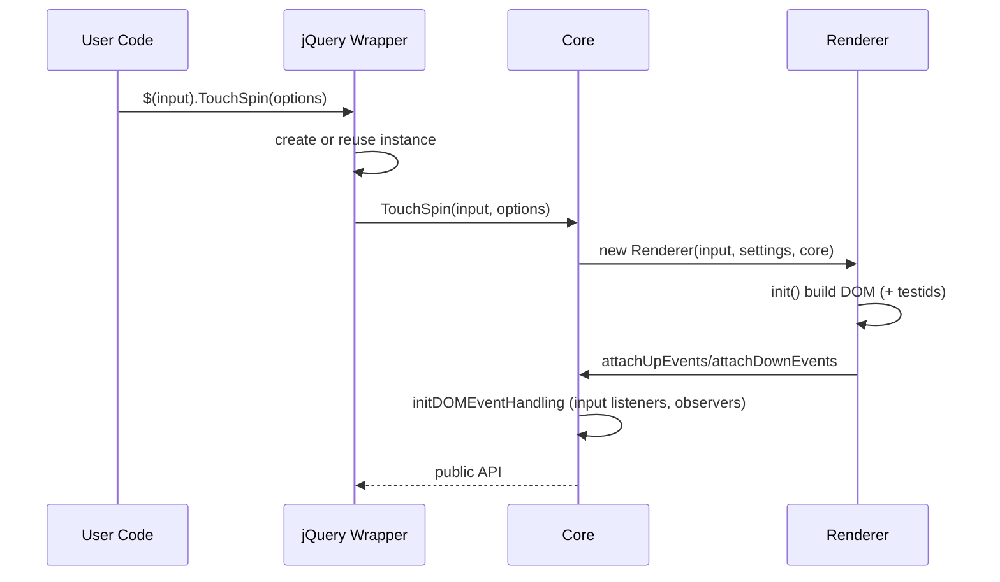
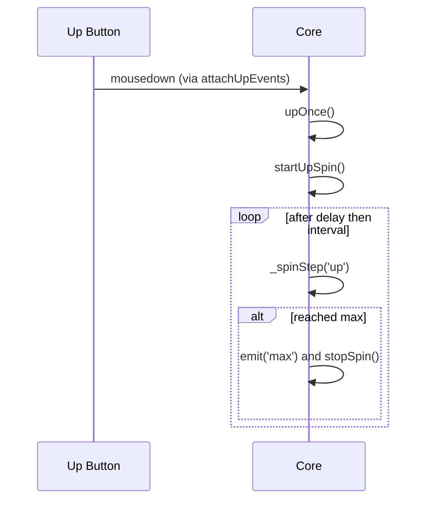
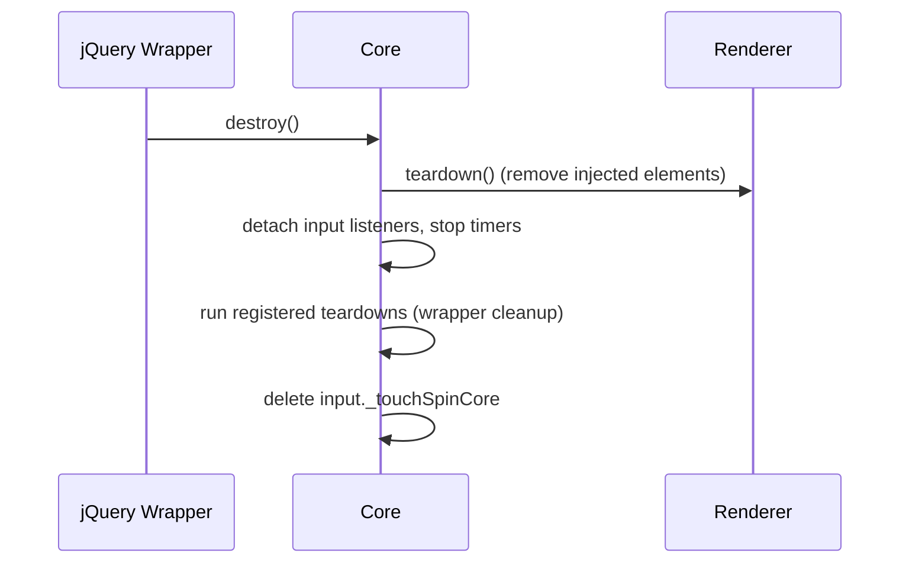

# Diagrams (Mermaid)

## Class Overview

```mermaid
classDiagram
  class TouchSpinCore {
    +constructor(inputEl, opts)
    +getValue()
    +setValue(v)
    +upOnce()
    +downOnce()
    +startUpSpin()
    +startDownSpin()
    +stopSpin()
    +updateSettings(partial)
    +initDOMEventHandling()
    +destroy()
    +on(event, handler)
    +off(event, handler)
    +observeSetting(name, cb)
    +attachUpEvents(el)
    +attachDownEvents(el)
  }

  class JQueryWrapper {
    +installJqueryTouchSpin(jQuery)
    +TouchSpin(args)
  }

  class Renderer {
    +init()
    +teardown()
  }
  <<abstract>> Renderer
  class Bootstrap3Renderer
  class Bootstrap4Renderer
  class Bootstrap5Renderer
  class TailwindRenderer

  JQueryWrapper --> TouchSpinCore : forwards commands
  JQueryWrapper ..> TouchSpinCore : bridges events
  TouchSpinCore --> Renderer : uses
  Renderer <|-- Bootstrap3Renderer
  Renderer <|-- Bootstrap4Renderer
  Renderer <|-- Bootstrap5Renderer
  Renderer <|-- TailwindRenderer
```

## Init Sequence (Wrapper + Core + Renderer)

```mermaid
sequenceDiagram
  participant U as User Code
  participant J as jQuery Wrapper
  participant C as Core
  participant R as Renderer

  U->>J: $(input).TouchSpin(options)
  J->>J: create or reuse instance
  J->>C: TouchSpin(input, options)
  C->>R: new Renderer(input, settings, core)
  R->>R: init() build DOM (+ testids)
  R->>C: attachUpEvents/attachDownEvents
  C->>C: initDOMEventHandling (input listeners, observers)
  C-->>J: public API
```

## Spin Sequence (Hold Up)

```mermaid
sequenceDiagram
  participant Btn as Up Button
  participant C as Core

  Btn->>C: mousedown (via attachUpEvents)
  C->>C: upOnce()
  C->>C: startUpSpin()
  loop after delay then interval
    C->>C: _spinStep('up')
    alt reached max
      C->>C: emit('max') and stopSpin()
    end
  end
```

## Destroy Sequence

```mermaid
sequenceDiagram
  participant J as jQuery Wrapper
  participant C as Core
  participant R as Renderer

  J->>C: destroy()
  C->>R: teardown() (remove injected elements)
  C->>C: detach input listeners, stop timers
  C->>C: run registered teardowns (wrapper cleanup)
  C->>C: delete input._touchSpinCore
```
