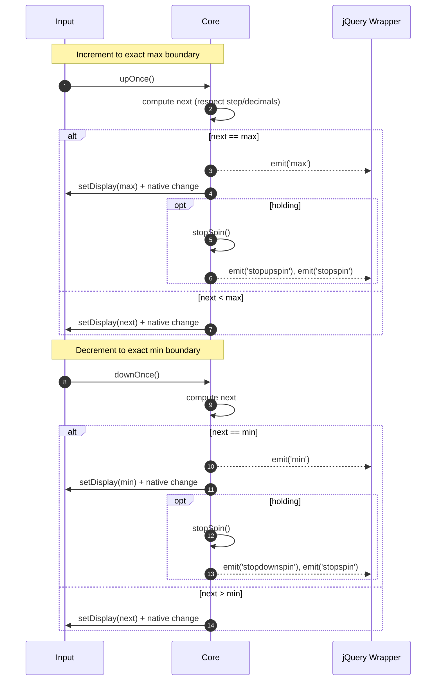

```mermaid
sequenceDiagram
  autonumber
  participant I as Input
  participant C as Core
  participant $ as jQuery Wrapper

  Note over I,C: Increment to exact max boundary
  I->>C: upOnce()
  C->>C: compute next (respect step/decimals)
  alt next == max
    C-->>$: emit('max')
    C->>I: setDisplay(max) + native change
    opt holding
      C->>C: stopSpin()
      C-->>$: emit('stopupspin'), emit('stopspin')
    end
  else next < max
    C->>I: setDisplay(next) + native change
  end

  Note over I,C: Decrement to exact min boundary
  I->>C: downOnce()
  C->>C: compute next
  alt next == min
    C-->>$: emit('min')
    C->>I: setDisplay(min) + native change
    opt holding
      C->>C: stopSpin()
      C-->>$: emit('stopdownspin'), emit('stopspin')
    end
  else next > min
    C->>I: setDisplay(next) + native change
  end
```

