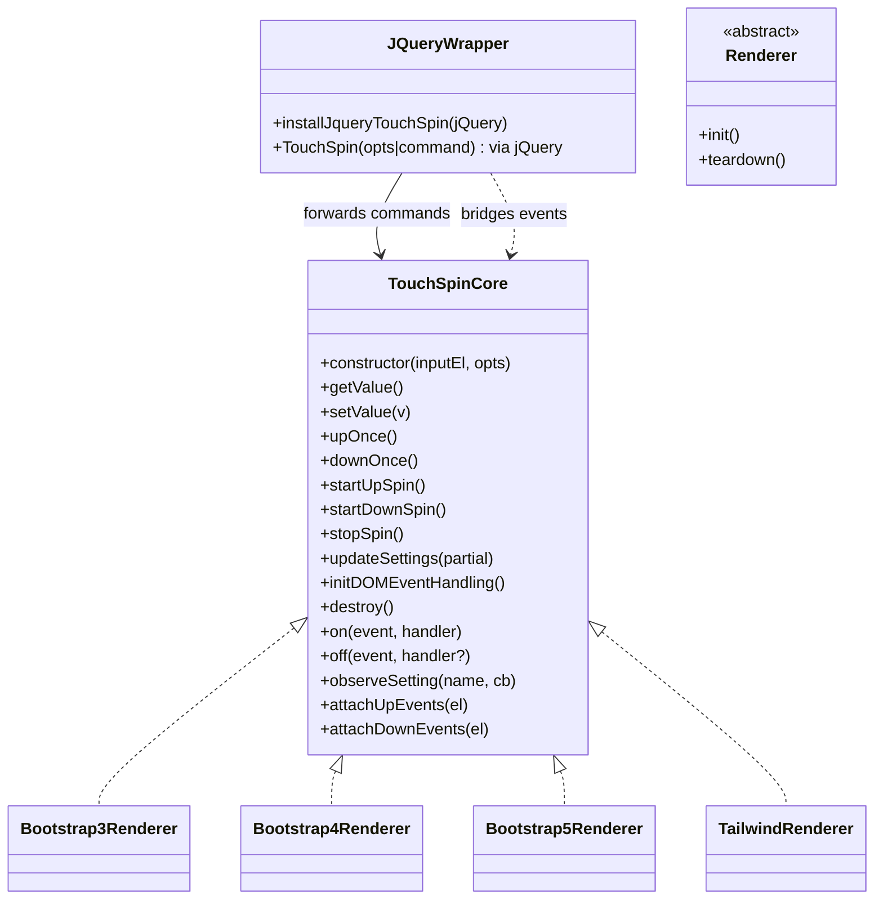

```mermaid
classDiagram
  class TouchSpinCore {
    +constructor(inputEl, opts)
    +getValue()
    +setValue(v)
    +upOnce()
    +downOnce()
    +startUpSpin()
    +startDownSpin()
    +stopSpin()
    +updateSettings(partial)
    +initDOMEventHandling()
    +destroy()
    +on(event, handler)
    +off(event, handler?)
    +observeSetting(name, cb)
    +attachUpEvents(el)
    +attachDownEvents(el)
  }

  class JQueryWrapper {
    +installJqueryTouchSpin(jQuery)
    +TouchSpin(opts|command) via jQuery
  }

  class Renderer <<abstract>> {
    +init()
    +teardown()
  }
  class Bootstrap3Renderer
  class Bootstrap4Renderer
  class Bootstrap5Renderer
  class TailwindRenderer

  JQueryWrapper --> TouchSpinCore : forwards commands
  JQueryWrapper ..> TouchSpinCore : bridges events
  TouchSpinCore <|.. Bootstrap3Renderer
  TouchSpinCore <|.. Bootstrap4Renderer
  TouchSpinCore <|.. Bootstrap5Renderer
  TouchSpinCore <|.. TailwindRenderer
```

