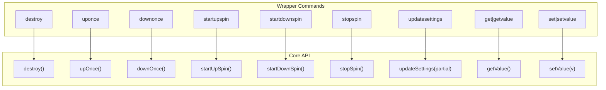

```mermaid
flowchart TD
  subgraph Wrapper Commands
    C1[destroy]
    C2[uponce]
    C3[downonce]
    C4[startupspin]
    C5[startdownspin]
    C6[stopspin]
    C7[updatesettings]
    C8["get|getvalue"]
    C9["set|setvalue"]
  end

  subgraph Core API
    A1["destroy()"]
    A2["upOnce()"]
    A3["downOnce()"]
    A4["startUpSpin()"]
    A5["startDownSpin()"]
    A6["stopSpin()"]
    A7["updateSettings(partial)"]
    A8["getValue()"]
    A9["setValue(v)"]
  end

  C1 --> A1
  C2 --> A2
  C3 --> A3
  C4 --> A4
  C5 --> A5
  C6 --> A6
  C7 --> A7
  C8 --> A8
  C9 --> A9
```
