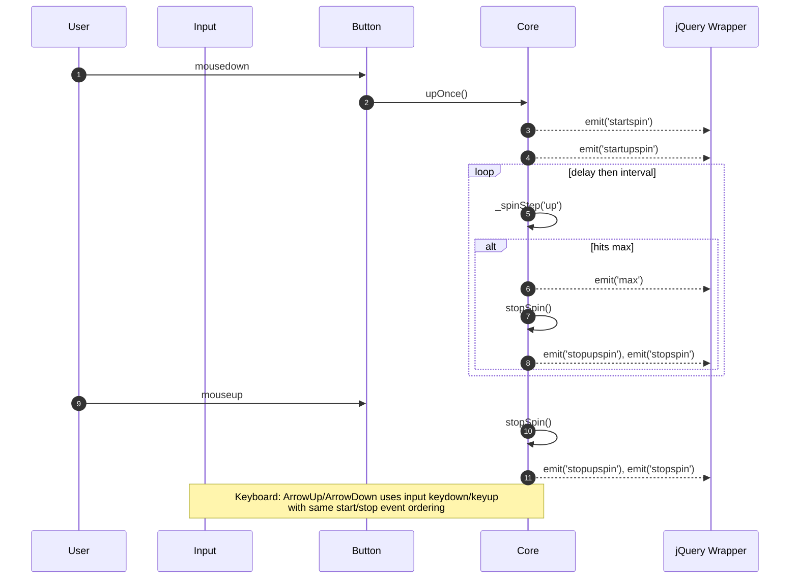

```mermaid
sequenceDiagram
  autonumber
  participant U as User
  participant I as Input
  participant Btn as Button
  participant C as Core
  participant J as jQuery Wrapper

  U->>Btn: mousedown
  Btn->>C: upOnce()
  C-->>J: emit('startspin')
  C-->>J: emit('startupspin')
  loop delay then interval
    C->>C: _spinStep('up')
    alt hits max
      C-->>J: emit('max')
      C->>C: stopSpin()
      C-->>J: emit('stopupspin'), emit('stopspin')
    end
  end
  U->>Btn: mouseup
  C->>C: stopSpin()
  C-->>J: emit('stopupspin'), emit('stopspin')

  Note over I,C: Keyboard: ArrowUp/ArrowDown uses input keydown/keyup<br/>with same start/stop event ordering
```
