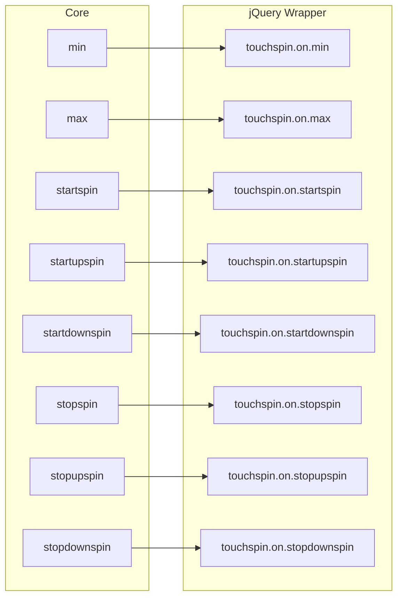

```mermaid
flowchart LR
  subgraph Core
    E1[min]
    E2[max]
    E3[startspin]
    E4[startupspin]
    E5[startdownspin]
    E6[stopspin]
    E7[stopupspin]
    E8[stopdownspin]
  end
  subgraph jQuery Wrapper
    J1[touchspin.on.min]
    J2[touchspin.on.max]
    J3[touchspin.on.startspin]
    J4[touchspin.on.startupspin]
    J5[touchspin.on.startdownspin]
    J6[touchspin.on.stopspin]
    J7[touchspin.on.stopupspin]
    J8[touchspin.on.stopdownspin]
  end
  E1 --> J1
  E2 --> J2
  E3 --> J3
  E4 --> J4
  E5 --> J5
  E6 --> J6
  E7 --> J7
  E8 --> J8
```

