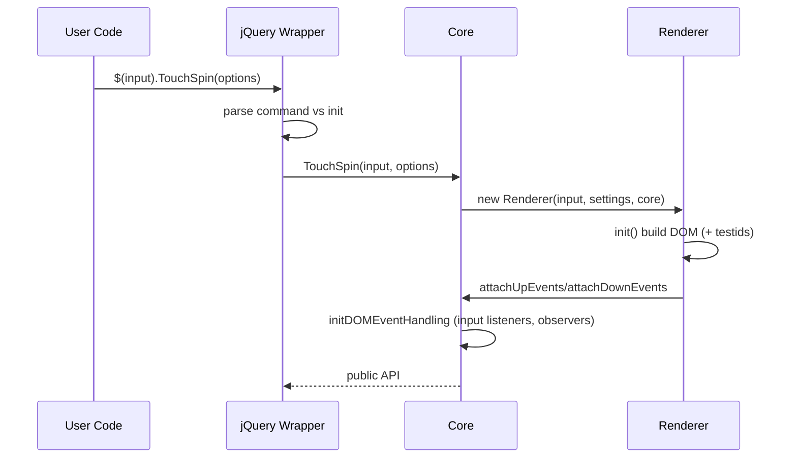

```mermaid
sequenceDiagram
  participant U as User Code
  participant $ as jQuery Wrapper
  participant C as Core
  participant R as Renderer

  U->>$: $(input).TouchSpin(options)
  $->>$: parse command vs init
  $->>C: TouchSpin(input, options)
  C->>R: new Renderer(input, settings, core)
  R->>R: init() build DOM (+ testids)
  R->>C: attachUpEvents/attachDownEvents
  C->>C: initDOMEventHandling (input listeners, observers)
  C-->>$: public API
```

