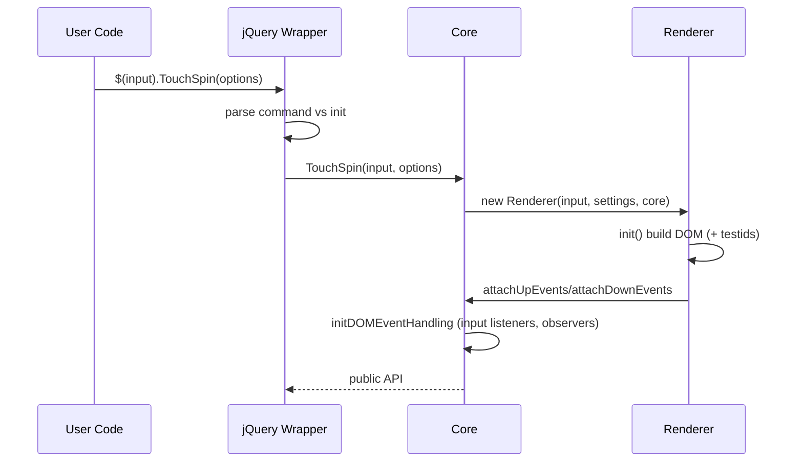

```mermaid
sequenceDiagram
  participant U as User Code
  participant JQ as jQuery Wrapper
  participant C as Core
  participant R as Renderer

  U->>JQ: $(input).TouchSpin(options)
  JQ->>JQ: parse command vs init
  JQ->>C: TouchSpin(input, options)
  C->>R: new Renderer(input, settings, core)
  R->>R: init() build DOM (+ testids)
  R->>C: attachUpEvents/attachDownEvents
  C->>C: initDOMEventHandling (input listeners, observers)
  C-->>JQ: public API
```
