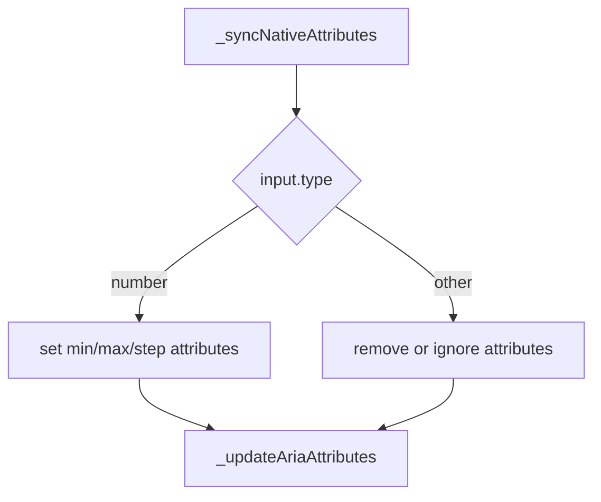

```mermaid
flowchart TD
  A[_syncNativeAttributes] --> B{input.type}
  B -- number --> C[set min/max/step attributes]
  B -- other --> D[remove or ignore attributes]
  C --> E[_updateAriaAttributes]
  D --> E
```

