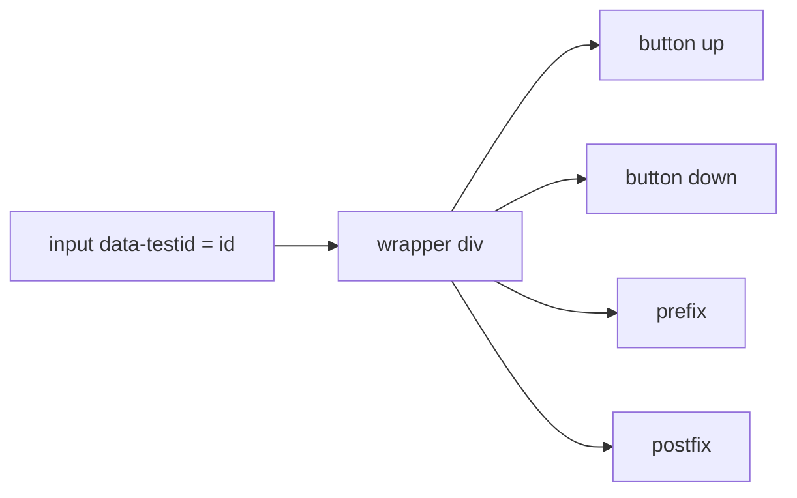

```mermaid
flowchart LR
  I["input data-testid = id"] --> W[wrapper div]
  W --> U[button up]
  W --> D[button down]
  W --> P1[prefix]
  W --> P2[postfix]

  %% All elements get data-touchspin-injected attributes (wrapper, up, down, prefix, postfix)
  %% All elements get data-testid attributes (id-wrapper, id-up, id-down, id-prefix, id-postfix)
```
