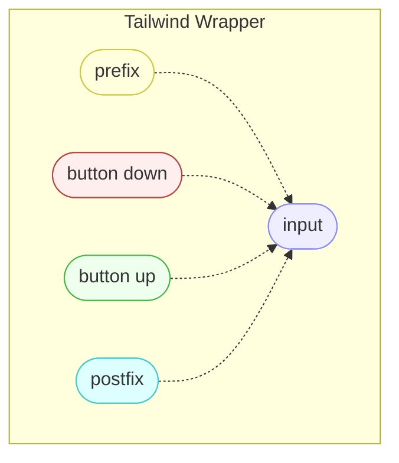

```mermaid
flowchart TB
  subgraph Tailwind Wrapper
    direction LR
    P1([prefix]):::prefix
    D1([button down]):::down
    I([input]):::input
    U1([button up]):::up
    P2([postfix]):::postfix
  end

  classDef input fill:#eef,stroke:#88f
  classDef up fill:#efe,stroke:#4b4
  classDef down fill:#fee,stroke:#b44
  classDef prefix fill:#ffd,stroke:#cc4
  classDef postfix fill:#dff,stroke:#4cc

  %% Data roles & testids added: prefix, postfix, up, down with {id}-* testids

  P1 -.-> I
  D1 -.-> I
  U1 -.-> I
  P2 -.-> I
```
