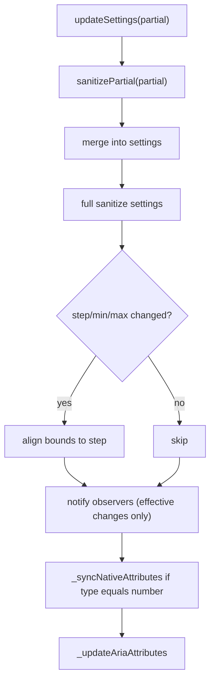

```mermaid
flowchart TD
  A["updateSettings(partial)"] --> B["sanitizePartial(partial)"]
  B --> C[merge into settings]
  C --> D["full sanitize settings"]
  D --> E{"step/min/max changed?"}
  E -- yes --> F["align bounds to step"]
  E -- no --> G[skip]
  F --> H["notify observers (effective changes only)"]
  G --> H
  H --> I["_syncNativeAttributes if type equals number"]
  I --> J["_updateAriaAttributes"]
```
