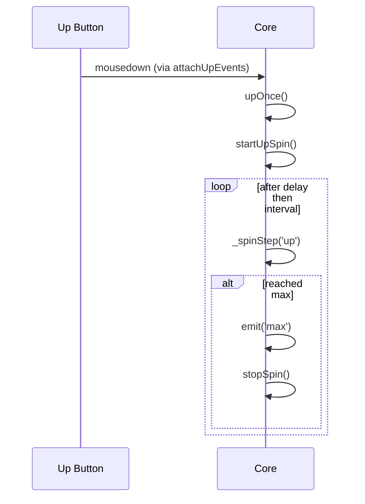

```mermaid
sequenceDiagram
  participant Btn as Up Button
  participant C as Core

  Btn->>C: mousedown (via attachUpEvents)
  C->>C: upOnce()
  C->>C: startUpSpin()
  loop after delay then interval
    C->>C: _spinStep('up')
    alt reached max
      C->>C: emit('max')
      C->>C: stopSpin()
    end
  end
```

