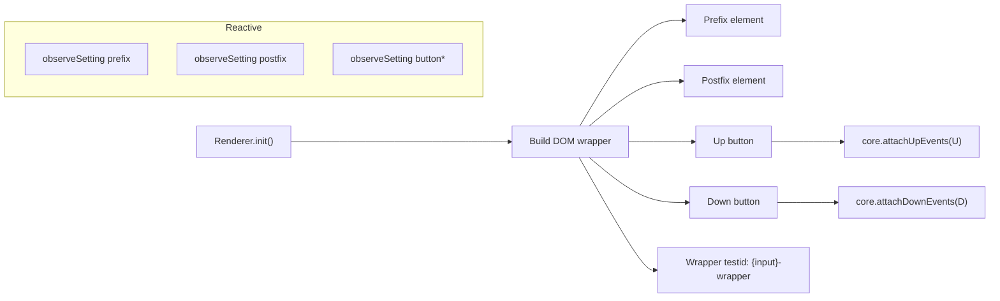

```mermaid
flowchart LR
  R["Renderer.init()"] --> B["Build DOM wrapper"]
  B --> P1["Prefix element"]
  B --> P2["Postfix element"]
  B --> U["Up button"]
  B --> D["Down button"]
  B --> W["Wrapper testid: {input}-wrapper"]
  %% testids added automatically: {input}-up, {input}-down, {input}-prefix, {input}-postfix
  U --> AE["core.attachUpEvents(U)"]
  D --> AD["core.attachDownEvents(D)"]
  subgraph Reactive
    O1["observeSetting prefix"]
    O2["observeSetting postfix"]
    O3["observeSetting button*"]
  end
```

