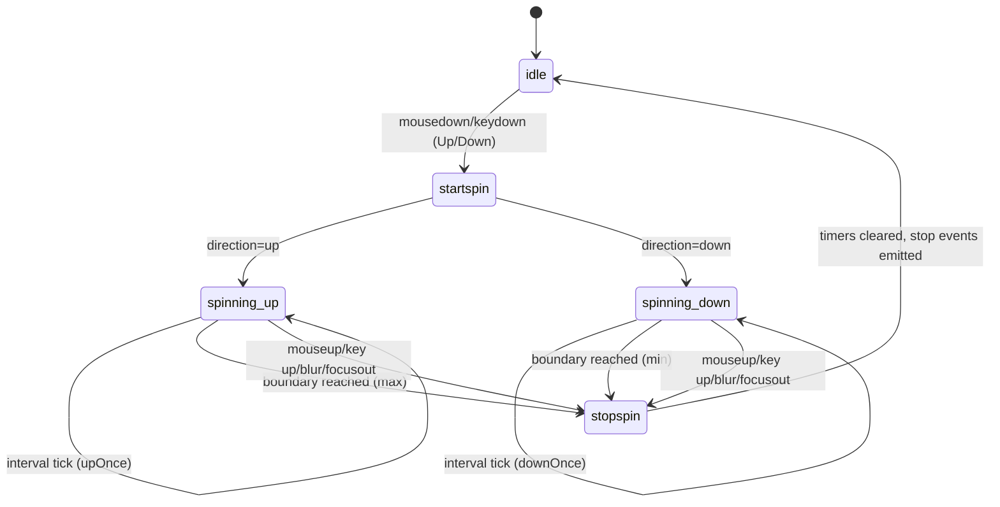

```mermaid
stateDiagram-v2
  [*] --> idle
  idle --> startspin: mousedown/keydown (Up/Down)
  startspin --> spinning_up: direction=up
  startspin --> spinning_down: direction=down
  spinning_up --> spinning_up: interval tick (upOnce)
  spinning_down --> spinning_down: interval tick (downOnce)
  spinning_up --> stopspin: boundary reached (max)
  spinning_down --> stopspin: boundary reached (min)
  spinning_up --> stopspin: mouseup/key up/blur/focusout
  spinning_down --> stopspin: mouseup/key up/blur/focusout
  stopspin --> idle: timers cleared, stop events emitted
```

