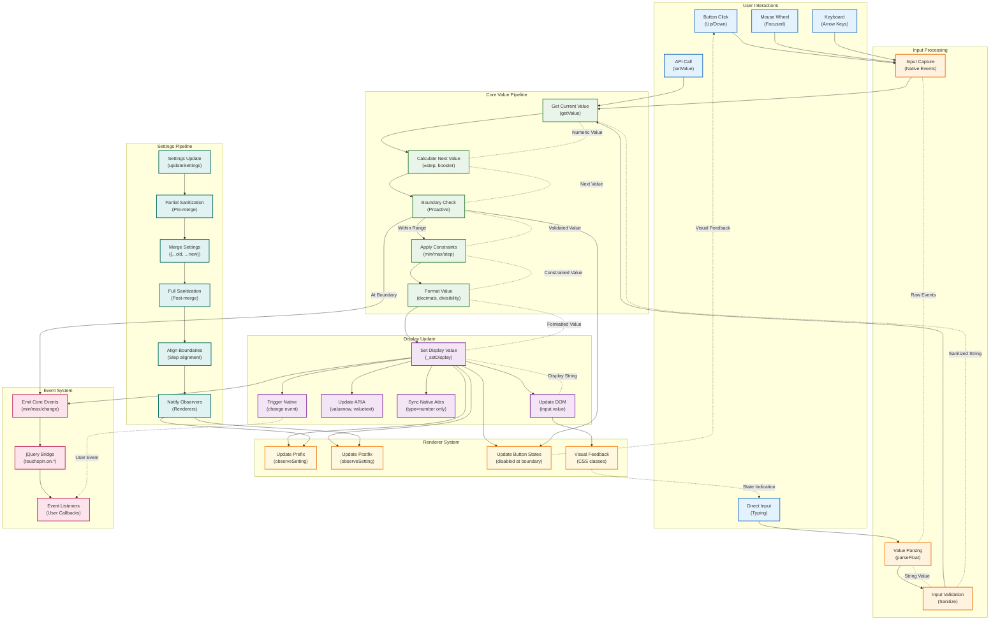

# TouchSpin Architecture Guide

This guide describes the TypeScript architecture that powers the TouchSpin monorepo. The goal is to show how responsibilities are split across packages, how data flows through the system, and where you can extend the component safely.

## Architecture Overview

```mermaid
graph TB
    %% Three-Stage Evolution Overview
    subgraph "Three-Stage TouchSpin Evolution"
        subgraph "Stage 1: TRUE Legacy (v3.x, 873 lines)"
            L_JQ["jQuery Plugin<br/>$.fn.TouchSpin"]
            L_Core["Monolithic Core<br/>(Hardcoded Bootstrap)"]
            L_HTML["Hardcoded HTML<br/>Templates"]
            
            L_JQ --> L_Core
            L_Core --> L_HTML
        end
        
        subgraph "Stage 2: In-Between (v4.x, 1,502 lines)"
            M_JQ["jQuery Plugin<br/>$.fn.TouchSpin + Commands"]
            M_Core["Enhanced Monolithic Core<br/>(Renderer System)"]
            M_Renderer["RendererFactory<br/>(Bootstrap 3/4/5)"]
            
            M_JQ --> M_Core
            M_Core --> M_Renderer
        end
        
        subgraph "Stage 3: New Modular (v5.x, ~300 lines/pkg)"
            subgraph "packages/core/"
                N_Core["TouchSpinCore<br/>(Framework Agnostic)"]
                N_Abstract["AbstractRenderer<br/>(Base Class)"]
                N_Factory["Factory Functions<br/>(TouchSpin, getTouchSpin)"]
            end
            
            subgraph "packages/jquery-plugin/"
                N_JQ["jQuery Wrapper<br/>(Optional Bridge)"]
            end
            
            subgraph "packages/renderers/"
                N_BS5["Bootstrap5Renderer"]
                N_BS4["Bootstrap4Renderer"]
                N_BS3["Bootstrap3Renderer"]
                N_TW["TailwindRenderer"]
            end
        end
    end
    
    %% Modern Architecture Detail
    subgraph "Modern Architecture Components"
        subgraph "Core Package"
            Core["TouchSpinCore"]
            Events["Event System<br/>(Native)"]
            Settings["Settings Management<br/>(Sanitization)"]
            API["Public API<br/>(Methods & Events)"]
            
            Core --> Events
            Core --> Settings
            Core --> API
        end
        
        subgraph "Renderer Package"
            Renderer["AbstractRenderer"]
            BS_Renderers["Bootstrap Renderers<br/>(3, 4, 5)"]
            TW_Renderer["Tailwind Renderer"]
            Custom["Custom Renderers<br/>(Extensible)"]
            
            Renderer --> BS_Renderers
            Renderer --> TW_Renderer
            Renderer --> Custom
        end
        
        subgraph "jQuery Package"
            Wrapper["jQuery Wrapper"]
            Bridge["Event Bridge<br/>(Core → jQuery)"]
            Compat["Compatibility Layer<br/>(Command API)"]
            
            Wrapper --> Bridge
            Wrapper --> Compat
        end
    end
    
    %% External Dependencies
    subgraph "External Dependencies"
        jQuery_Lib["jQuery<br/>(Optional)"]
        Bootstrap["Bootstrap CSS<br/>(3, 4, or 5)"]
        Tailwind_CSS["Tailwind CSS<br/>(Alternative)"]
        Browser["Browser APIs<br/>(DOM, Events)"]
        Custom_CSS["Custom CSS<br/>(Framework)"]
    end
    
    %% Application Integration
    subgraph "Application Layer"
        User_App["User Application"]
        Tests["Test Suite<br/>(Unit & Integration)"]
        Examples["Demo Pages<br/>(All Frameworks)"]
    end
    
    %% Modern Architecture Relationships
    N_JQ --> N_Factory
    N_Factory --> N_Core
    N_Core --> N_Abstract
    N_Abstract --> N_BS5
    N_Abstract --> N_BS4
    N_Abstract --> N_BS3
    N_Abstract --> N_TW
    
    %% Modern Component Relationships
    Wrapper --> Core
    Core --> Renderer
    Renderer --> BS_Renderers
    Renderer --> TW_Renderer
    
    %% External Dependencies
    N_JQ -.-> jQuery_Lib
    N_BS5 -.-> Bootstrap
    N_BS4 -.-> Bootstrap
    N_BS3 -.-> Bootstrap
    N_TW -.-> Tailwind_CSS
    Custom -.-> Custom_CSS
    N_Core --> Browser
    
    %% Application Integration
    User_App --> N_Factory
    User_App --> N_JQ
    Tests --> Core
    Tests --> Renderer
    Examples --> N_Factory
    
    %% Evolution Flow
    L_JQ -.->|"v3→v4<br/>Added Commands"| M_JQ
    M_JQ -.->|"v4→v5<br/>Modular Rewrite"| N_JQ
    L_Core -.->|"Enhanced"| M_Core
    M_Core -.->|"Separated"| N_Core
    L_HTML -.->|"Abstracted"| M_Renderer
    M_Renderer -.->|"Modularized"| N_BS5
    
    %% Key Architectural Benefits
    subgraph "Key Benefits of Modern Architecture"
        Benefit1["✅ Framework Agnostic Core"]
        Benefit2["✅ Full Unit Test Coverage"]
        Benefit3["✅ Pluggable Renderers"]
        Benefit4["✅ Backward Compatibility"]
        Benefit5["✅ Tree-Shakable Modules"]
        Benefit6["✅ Modern JavaScript Patterns"]
    end
    
    %% Styling
    classDef legacyStyle fill:#ffebee,stroke:#c62828,stroke-width:2px
    classDef intermediateStyle fill:#fff3e0,stroke:#ef6c00,stroke-width:2px
    classDef modernStyle fill:#e8f5e8,stroke:#2e7d32,stroke-width:2px
    classDef coreStyle fill:#e3f2fd,stroke:#1565c0,stroke-width:2px
    classDef rendererStyle fill:#fce4ec,stroke:#c2185b,stroke-width:2px
    classDef wrapperStyle fill:#f3e5f5,stroke:#7b1fa2,stroke-width:2px
    classDef benefitStyle fill:#e0f2f1,stroke:#00695c,stroke-width:2px
    
    %% Apply styles
    class L_JQ,L_Core,L_HTML legacyStyle
    class M_JQ,M_Core,M_Renderer intermediateStyle
    class N_Core,N_Abstract,N_Factory,Core,Events,Settings,API modernStyle
    class N_BS5,N_BS4,N_BS3,N_TW,Renderer,BS_Renderers,TW_Renderer,Custom rendererStyle
    class N_JQ,Wrapper,Bridge,Compat wrapperStyle
    class Benefit1,Benefit2,Benefit3,Benefit4,Benefit5,Benefit6 benefitStyle
```



## Architecture Overview Explanation

This diagram illustrates the complete three-stage evolution of TouchSpin and the modern modular architecture.

### Three-Stage Evolution

**Stage 1 (TRUE Legacy):** Simple monolithic jQuery plugin with hardcoded Bootstrap HTML templates.

**Stage 2 (In-Between):** Enhanced monolithic structure with renderer system for multi-Bootstrap support and command API.

**Stage 3 (New Modular):** Complete architectural rewrite with framework-agnostic core and pluggable renderers.

### Modern Architecture Components

**Core Package (`packages/core/`):**
- Framework-agnostic business logic
- Native event system
- Comprehensive settings sanitization
- Public API for methods and events

**Renderer Package (`packages/renderers/`):**
- Pluggable rendering system
- Bootstrap 3/4/5 support
- Tailwind CSS support
- Extensible for custom frameworks

**jQuery Package (`packages/jquery-plugin/`):**
- Optional backward compatibility
- Event bridging from core to jQuery
- Command API compatibility layer

### Key Architectural Benefits

1. **Framework Agnostic Core** - Use with any CSS framework
2. **Full Unit Test Coverage** - Test individual components in isolation
3. **Pluggable Renderers** - Easy to add new framework support
4. **Backward Compatibility** - Existing jQuery code continues to work
5. **Tree-Shakable Modules** - Only load what you need
6. **Modern JavaScript Patterns** - Clean, maintainable code structure

### Integration Points

**For jQuery Users:**
```javascript
$('#spinner').TouchSpin({min: 0, max: 100}); // Still works
```

**For Modern Applications:**
```javascript
const api = TouchSpin('#spinner', {min: 0, max: 100}); // Clean API
```

**For Framework Integration:**
```javascript
const core = new TouchSpinCore(element, settings);
const renderer = new CustomRenderer(element, settings, core);
```

This architecture enables TouchSpin to serve both legacy applications requiring jQuery compatibility and modern applications needing framework-agnostic components.

## Data Flow



## Data Flow Explanation

This diagram shows how data flows through the TouchSpin system from user input to display update.

### Primary Data Paths

**1. User Interaction → Display Update**
- User clicks button or types value
- Input captured and parsed
- Core pipeline processes value
- Display updated with new value

**2. API Call → Display Update**
- External code calls `setValue()`
- Value goes through constraint pipeline
- Display updated if value changed

**3. Settings Update → Renderer Update**
- Settings changed via `updateSettings()`
- Sanitization and validation applied
- Observers notified of changes
- Renderers update visual elements

### Key Processing Stages

**Input Processing:**
- Raw input captured from various sources
- String values parsed to numbers
- Basic validation and sanitization

**Core Value Pipeline:**
- Current value retrieved
- Next value calculated (with booster logic)
- Proactive boundary checking
- Constraints applied (min/max/step)
- Value formatted for display

**Event System:**
- Core events emitted at key points
- jQuery bridge translates to legacy events
- User callbacks invoked

**Display System:**
- Input field value updated
- ARIA attributes updated for accessibility
- Native attributes synced (type="number" only)
- Native change event triggered

**Renderer Integration:**
- Visual elements updated (prefix/postfix)
- Button states managed (disabled at boundaries)
- CSS classes applied for feedback

### Data Validation Points

**1. Input Validation**
- String sanitization
- Number parsing
- Basic format checks

**2. Boundary Validation (Proactive)**
- Check before operation
- Prevent unnecessary calculations
- Emit boundary events

**3. Constraint Application**
- Min/max enforcement
- Step alignment
- Decimal precision

**4. Settings Sanitization**
- Pre-merge partial validation
- Post-merge full validation
- Boundary alignment
- Observer notification

### Event Flow

**Core Events:**
- `change` - Value changed
- `min`/`max` - Boundary reached
- `startspin`/`stopspin` - Spinning state
- `boostchange` - Acceleration changed

**jQuery Bridge Events:**
- `touchspin.on.change`
- `touchspin.on.min`/`touchspin.on.max`
- `touchspin.on.startspin`/`touchspin.on.stopspin`

### Feedback Loops

**Visual Feedback:**
- Button states reflect current boundaries
- CSS classes indicate spinner state
- ARIA attributes provide accessibility info

**Event Feedback:**
- Native change events trigger user handlers
- Button visual feedback affects user interaction
- State indication guides user behavior

This data flow ensures consistent, predictable behavior while maintaining separation of concerns between input processing, core logic, event handling, and display management.

## Package Responsibilities

### Core Package (`packages/core`)

**Responsibilities:**
- Business logic (validation, calculations, state management)
- Event system (framework-agnostic event emitter)
- Settings management with comprehensive sanitization
- Public API for direct usage

**Key Exports:**
- `TouchSpinCore` — state machine that owns business rules
- `AbstractRenderer` / `RendererConstructor` — renderer contracts
- `TouchSpin()` / `getTouchSpin()` — factory helpers that attach instances to inputs

**Usage (TypeScript):**
```ts
import { TouchSpin } from '@touchspin/core';
import Bootstrap5Renderer from '@touchspin/renderer-bootstrap5';

const input = document.querySelector('input[type="number"]') as HTMLInputElement;
const api = TouchSpin(input, {
  renderer: Bootstrap5Renderer,
  min: 0,
  max: 100,
  step: 1,
});

api.on('change', ({ newValue }) => console.log('Value:', newValue));
api.upOnce();
```

### Renderer Packages (`packages/renderers/*`)

**Responsibilities:**
- Framework-specific DOM construction
- CSS class management
- Visual element updates (prefix/postfix, button states)
- Event attachment coordination with core

**Available Renderers:**
- `Bootstrap5Renderer` - Bootstrap 5.x support
- `Bootstrap4Renderer` - Bootstrap 4.x support  
- `Bootstrap3Renderer` - Bootstrap 3.x support
- `TailwindRenderer` - Tailwind CSS support
- `VanillaRenderer` - Framework-agnostic styling

**Renderer Pattern:**
```ts
import { AbstractRenderer } from '@touchspin/core/renderer';

export default class CustomRenderer extends AbstractRenderer {
  init(): void {
    this.wrapper = this.buildInputGroup();

    const upButton = this.wrapper.querySelector('[data-touchspin-injected="up"]');
    const downButton = this.wrapper.querySelector('[data-touchspin-injected="down"]');

    this.core.attachUpEvents(upButton);
    this.core.attachDownEvents(downButton);

    this.core.observeSetting('prefix', (value) => this.updatePrefix(value ?? ''));
  }
}
```

### jQuery Plugin (`packages/jquery-plugin`)

**Responsibilities:**
- Backward compatibility with jQuery-based code
- Event bridging (core events → jQuery events)
- Command API support (`TouchSpin('uponce')`)
- Chainable jQuery interface

**Compatibility Layer:**
```ts
// Modern API
const api = TouchSpin('#spinner', options);

// jQuery API (same functionality)
$('#spinner').TouchSpin(options);
$('#spinner').TouchSpin('uponce');
$('#spinner').on('touchspin.on.max', handler);
```

## Core Architecture Details

### TouchSpinCore Class

The heart of the system is the `TouchSpinCore` class:

```ts
class TouchSpinCore {
  constructor(input: HTMLInputElement, options: TouchSpinCoreOptions) {
    this.input = input;
    this.settings = TouchSpinCore.sanitizePartialSettings(options, DEFAULTS);
    this.attachLifecycle();
  }

  upOnce() { /* ... */ }
  downOnce() { /* ... */ }
  startUpSpin() { /* ... */ }
  startDownSpin() { /* ... */ }
  stopSpin() { /* ... */ }
  getValue() { /* ... */ }
  setValue(value: string | number) { /* ... */ }
  updateSettings(options: Partial<TouchSpinCoreOptions>) { /* ... */ }

  on(event: TouchSpinCallableEvent, handler: (detail?: unknown) => void) { /* ... */ }
  off(event: TouchSpinCallableEvent, handler: (detail?: unknown) => void) { /* ... */ }
  destroy() { /* ... */ }
}
```

### Event System

TouchSpin uses a **framework-agnostic event system** with automatic jQuery bridging:

**Core Events:**
- `change` - Value changed
- `min` / `max` - Boundary reached
- `startspin` / `stopspin` - Spinning state changes
- `boostchange` - Step size changed during acceleration

**Event Flow:**
```ts
// Core emits framework-agnostic events
core.emit('max', { value: 100, direction: 'up' });

// jQuery wrapper automatically bridges to legacy events
$(input).trigger('touchspin.on.max', { value: 100, direction: 'up' });
```

### Settings Management

Settings undergo **comprehensive sanitization** to ensure valid configurations:

```ts
const sanitized = TouchSpinCore.sanitizePartialSettings(
  { step: 0, decimals: -1, min: Number.NaN, max: 100 },
  core.settings,
);

// Result: { step: 1, decimals: 0, min: null, max: 100 }
```

**Observer Pattern** for reactive updates:
```ts
this.core.observeSetting('prefix', (next) => {
  this.prefixElement.textContent = next ?? '';
});
```

### Boundary Logic

TouchSpin uses **proactive boundary checking** for optimal performance:

```javascript
upOnce() {
    // Check boundary BEFORE operation
    if (this.getValue() === this.settings.max) {
        this.emit('max');
        return; // Prevent unnecessary calculation
    }
    
    // Safe to proceed with increment
    const nextValue = this._nextValue('up', this.getValue());
    this._setDisplay(nextValue, true);
}
```

This prevents wasted calculations and provides predictable event timing.

## Extending TouchSpin

### Creating Custom Renderers

TouchSpin can support any CSS framework through custom renderers. See the **[Creating Custom Renderers Guide](creating-custom-renderer.md)** for complete details.

**Quick Example:**
```javascript
import { AbstractRenderer } from '@touchspin/core';

class MaterialRenderer extends AbstractRenderer {
    init() {
        this.wrapper = this.buildMaterialWrapper();
        const upButton = this.wrapper.querySelector('.mdc-button--up');
        this.core.attachUpEvents(upButton);
        
        // Observe settings for reactive updates
        this.core.observeSetting('prefix', this.updateMaterialPrefix);
    }
    
    buildMaterialWrapper() {
        // Material Design HTML structure
        const wrapper = document.createElement('div');
        wrapper.className = 'mdc-text-field mdc-text-field--outlined';
        // ... Material-specific DOM construction
        return wrapper;
    }
}
```

### Creating Framework Wrappers

TouchSpin can be integrated into any JavaScript framework. See the **[Creating Framework Wrappers Guide](creating-framework-wrapper.md)** for detailed examples.

**Angular Example:**
```typescript
@Component({
    selector: 'app-touchspin',
    template: '<input [id]="inputId">'
})
export class TouchSpinComponent implements OnInit, OnDestroy {
    @Input() options: TouchSpinOptions = {};
    @Output() valueChange = new EventEmitter<number>();
    
    private api: TouchSpinAPI;
    
    ngOnInit() {
        this.api = TouchSpin(`#${this.inputId}`, this.options);
        this.api.on('change', (data) => this.valueChange.emit(data.newValue));
    }
    
    ngOnDestroy() {
        this.api?.destroy();
    }
}
```

**React Hook Example:**
```javascript
function useTouchSpin(inputRef, options) {
    const [value, setValue] = useState(0);
    const apiRef = useRef(null);
    
    useEffect(() => {
        if (inputRef.current) {
            apiRef.current = TouchSpin(inputRef.current, options);
            apiRef.current.on('change', (data) => setValue(data.newValue));
        }
        
        return () => apiRef.current?.destroy();
    }, [inputRef, options]);
    
    return { value, api: apiRef.current };
}
```

## API Reference

### Core API Methods

| Method | Parameters | Returns | Description |
|--------|------------|---------|-------------|
| `getValue()` | none | `number` | Get current numeric value |
| `setValue(value)` | `number` | `void` | Set value with validation |
| `upOnce()` | none | `void` | Increment by one step |
| `downOnce()` | none | `void` | Decrement by one step |
| `startUpSpin()` | none | `void` | Begin continuous increment |
| `startDownSpin()` | none | `void` | Begin continuous decrement |
| `stopSpin()` | none | `void` | Stop any spinning |
| `updateSettings(opts)` | `object` | `void` | Update configuration |
| `on(event, callback)` | `string, function` | `void` | Add event listener |
| `off(event, callback)` | `string, function` | `void` | Remove event listener |
| `destroy()` | none | `void` | Clean up instance |

### Configuration Options

**Core Settings:**
- `min` / `max` - Value boundaries
- `step` - Increment/decrement amount  
- `decimals` - Display precision
- `initval` - Initial value if input empty

**UI Settings:**
- `prefix` / `postfix` - Text before/after input
- `verticalbuttons` - Button layout
- `mousewheel` - Mouse wheel support

**Behavior Settings:**
- `booster` - Step size acceleration
- `stepinterval` - Spinning speed
- `forcestepdivisibility` - Step alignment

See **[Options Reference](reference/options-feature-matrix.md)** for complete details.

### Events

**Value Events:**
- `change` - Value changed: `{oldValue, newValue}`
- `min` / `max` - Boundary reached: `{value, direction}`

**Interaction Events:**
- `startspin` / `stopspin` - Spinning state: `{direction}`
- `startupspin` / `startdownspin` - Direction-specific start
- `stopupspin` / `stopdownspin` - Direction-specific stop

**Acceleration Events:**
- `boostchange` - Step size changed: `{step, isCapped, level}`

See **[Event Reference](reference/event-matrix.md)** for timing and data details.

## Getting Started

### Installation

```bash
yarn add @touchspin/core @touchspin/renderer-bootstrap5
```

### Basic Usage

```ts
import { TouchSpin } from '@touchspin/core';
import Bootstrap5Renderer from '@touchspin/renderer-bootstrap5';

const input = document.querySelector('#my-input') as HTMLInputElement;
const api = TouchSpin(input, {
  renderer: Bootstrap5Renderer,
  min: 0,
  max: 100,
  step: 1,
  prefix: '$',
});

api.on('change', ({ newValue }) => {
  console.log(`Value changed to: ${newValue}`);
});
```

### jQuery Compatibility

```javascript
// Existing jQuery code works unchanged
$('#my-input').TouchSpin({
    min: 0,
    max: 100,
    step: 1,
    prefix: '$'
});

$('#my-input').on('touchspin.on.change', function(e, data) {
    console.log(`Value changed to: ${data.newValue}`);
});
```

## Documentation Structure

- **[API Quick Reference](reference/api-quick-reference.md)** - Complete API documentation with examples
- **[Options Reference](reference/options-feature-matrix.md)** - All configuration options
- **[Event Reference](reference/event-matrix.md)** - Event system details
- **[Common Patterns](reference/common-patterns.md)** - Implementation examples
- **[Creating Custom Renderers](creating-custom-renderer.md)** - Build CSS framework support
- **[Creating Framework Wrappers](creating-framework-wrapper.md)** - Framework integration guide

## Architecture Principles

### 1. Separation of Concerns
- **Core**: Business logic only
- **Renderers**: UI construction only  
- **Wrappers**: Framework integration only

### 2. Framework Independence
- Core works with any CSS framework
- Renderers provide framework-specific UI
- No framework assumptions in business logic

### 3. Backward Compatibility
- 100% compatibility with existing jQuery code
- New features available alongside legacy interface
- Migration is opt-in, never required

### 4. Extensibility
- Plugin architecture for renderers
- Observer pattern for reactive updates
- Clean interfaces for framework integration

### 5. Modern JavaScript
- ES6+ classes and modules
- Comprehensive JSDoc documentation
- Tree-shakable package structure
- Native event system with fallbacks

This architecture enables TouchSpin to serve both legacy projects needing stability and modern projects requiring flexibility, all while maintaining the simple, familiar interface that made it popular.
