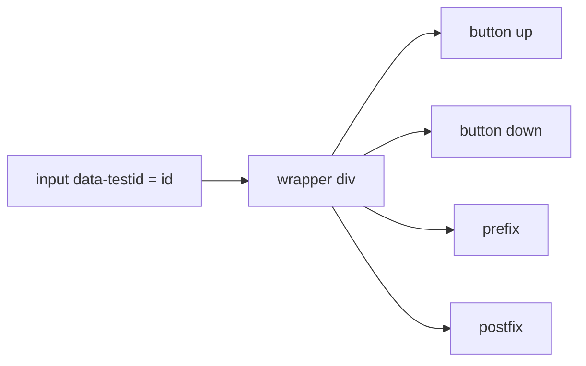
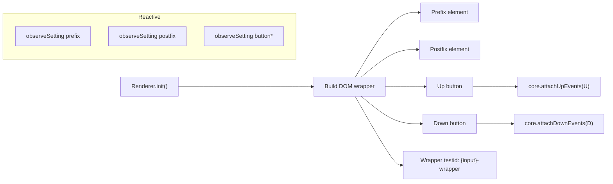

# Renderer Guide (Responsibilities and Gotchas)

Renderers provide framework-specific DOM while core owns behavior. This guide consolidates the renderer contract and practical tips.

Contract (all renderers)
- Build/augment DOM around the input and add roles via `data-touchspin-injected`:
  - `wrapper`, `up`, `down`, `prefix`, `postfix` (and `vertical-wrapper` when vertical buttons are used)
- Derive deterministic testids from `data-testid` on the input:
  - `{id}-wrapper`, `{id}-up`, `{id}-down`, `{id}-prefix`, `{id}-postfix`
- Call `core.attachUpEvents(upButton)` and `core.attachDownEvents(downButton)` after building buttons.
- Subscribe to `core.observeSetting` to reactively update prefix/postfix text/classes and vertical button variants.
- Implement `teardown()` and remove injected elements and any renderer-specific listeners.

Framework notes
- Bootstrap 3
  - Use `.input-group` with `.input-group-addon` for prefix/postfix; buttons may be in `.input-group-btn` wrappers.
- Bootstrap 4
  - Use `.input-group-prepend` / `.input-group-append`; prefix/postfix inside `.input-group-text`.
- Bootstrap 5
  - Simpler structure; prefix/postfix as `.input-group-text` siblings; no prepend/append components.
- Tailwind
  - No framework components; plain elements styled via utilities.

Accessibility and focusability
- Apply accessible labels on buttons (Increase/Decrease) or aria-label attributes.
- Honor `focusablebuttons` by providing or removing `tabindex` as needed.

Gotchas
- Always mark the wrapper with `data-touchspin-injected="wrapper"` so core can locate associated elements from the input.
- Render prefix/postfix even if empty; core may hide them depending on settings.
- Do not attach behavior listeners directly (mouse/keyboard/wheel) — call core attach methods and let the core manage input listeners.
- Keep teardown idempotent; core may call `destroy()` after partial failures.

Checklist before shipping a renderer
- Roles present for wrapper, up, down, prefix, postfix; vertical wrapper when applicable.
- Testids derived correctly from the input’s `data-testid`.
- Buttons are focusable per `focusablebuttons`, labeled for screen readers.
- `init()` calls core attach methods; `teardown()` removes injected nodes.
- Works across disabled/readonly toggles and min/max/step updates (MutationObserver paths).

