# Options, Data Attributes, and Events

This reference consolidates options/data attributes and the event model (core → jQuery wrapper) for v5. Semantics generally match v4; v5 adds stronger sanitization and clearer ordering.

```mermaid
gantt
    title TouchSpin Event Lifecycle & Timing
    dateFormat X
    axisFormat %L ms
    
    section Button Press & Hold
    mousedown           :milestone, m1, 0, 0ms
    startspin           :milestone, m2, 50, 50ms
    startupspin         :milestone, m3, 75, 75ms
    stepintervaldelay   :active, delay, 75, 575ms
    first step          :milestone, m4, 575, 575ms
    stepinterval        :active, step1, 575, 675ms
    second step         :milestone, m5, 675, 675ms
    booster trigger     :milestone, m6, 775, 775ms
    boosted step        :milestone, m7, 850, 850ms
    mouseup             :milestone, m8, 1200, 1200ms
    stopupspin          :milestone, m9, 1225, 1225ms
    stopspin            :milestone, m10, 1250, 1250ms
    
    section Value Changes
    initial value       :milestone, v1, 0, 0ms
    first increment     :milestone, v2, 575, 575ms
    change event        :milestone, c1, 600, 600ms
    second increment    :milestone, v3, 675, 675ms
    change event        :milestone, c2, 700, 700ms
    boosted increment   :milestone, v4, 850, 850ms
    boostchange event   :milestone, bc1, 875, 875ms
    change event        :milestone, c3, 900, 900ms
    
    section Boundary Events
    approach max        :active, approach, 800, 1100ms
    hit max boundary    :milestone, maxhit, 1100, 1100ms
    max event           :milestone, maxevent, 1125, 1125ms
    spin stops          :milestone, spinstop, 1150, 1150ms
```



```mermaid
sequenceDiagram
    participant User as User
    participant Button as Button Element  
    participant Core as TouchSpinCore
    participant Events as Event System
    participant Callbacks as User Callbacks
    participant Display as DOM Display
    
    Note over User,Display: Single Button Click (upOnce)
    
    User->>Button: Click (mousedown + mouseup)
    Button->>Core: _handleUpButtonDown()
    
    Core->>Core: Check if at max boundary
    alt Already at maximum
        Core->>Events: emit('max', {value, direction: 'up'})
        Events->>Callbacks: Trigger max callbacks
        Note right of Core: Operation prevented,<br/>no value change
    else Within range
        Core->>Core: _nextValue('up', currentValue)
        Core->>Core: Apply booster logic if spinning
        Core->>Core: _setDisplay(newValue, triggerChange=true)
        Core->>Display: Update input.value
        Core->>Display: Update ARIA attributes
        Core->>Events: emit('change', {oldValue, newValue})
        Events->>Callbacks: Trigger change callbacks
    end
    
    Note over User,Display: Button Hold (Continuous Spinning)
    
    User->>Button: mousedown (start hold)
    Button->>Core: _handleUpButtonDown()
    
    Core->>Core: Check if at boundary
    alt At boundary
        Core->>Events: emit('max')
        Note right of Core: Prevent spinning from boundary
    else Can spin
        Core->>Events: emit('startspin', {direction: 'up'})
        Core->>Events: emit('startupspin', {direction: 'up'})
        Events->>Callbacks: Trigger startspin callbacks
        Events->>Callbacks: Trigger startupspin callbacks
        
        Core->>Core: Start stepintervaldelay timer
        Note right of Core: Default 500ms delay
        
        Core->>Core: After delay, start stepinterval timer
        Note right of Core: Default 100ms intervals
        
        loop Every stepinterval while held
            Core->>Core: _nextValue('up', current)
            Core->>Core: Check boundary before operation
            alt Reached boundary
                Core->>Events: emit('max', {value, direction: 'up'})
                Core->>Core: stopSpin()
                break
            else Still in range
                Core->>Core: Apply booster calculation
                alt Booster level changed
                    Core->>Events: emit('boostchange', {step, isCapped, level})
                    Events->>Callbacks: Trigger boostchange callbacks
                end
                Core->>Core: _setDisplay(newValue, true)
                Core->>Display: Update display
                Core->>Events: emit('change', {oldValue, newValue})
                Events->>Callbacks: Trigger change callbacks
            end
        end
    end
    
    User->>Button: mouseup (end hold)
    Button->>Core: _handleUpButtonUp()
    Core->>Core: stopSpin()
    Core->>Events: emit('stopupspin', {direction: 'up'})
    Core->>Events: emit('stopspin', {direction: 'up'})
    Events->>Callbacks: Trigger stopupspin callbacks
    Events->>Callbacks: Trigger stopspin callbacks
    
    Note over User,Display: Direct Input (Typing)
    
    User->>Display: Type in input field
    Display->>Core: input event
    Core->>Core: _handleInputChange(event)
    
    Core->>Core: Get current input value
    Core->>Core: _sanitizeInputValue(rawValue)
    alt Value needs sanitization
        Core->>Display: event.stopImmediatePropagation()
        Note right of Core: Prevent invalid value<br/>from propagating
    else Value is valid
        Note right of Core: Allow event to continue
    end
    
    User->>Display: Blur input field
    Display->>Core: blur event
    Core->>Core: _handleInputBlur(true)
    Core->>Core: _checkValue(true) with triggerChange
    Core->>Core: Apply full constraint pipeline
    Core->>Core: _setDisplay(sanitizedValue, true)
    Core->>Display: Update display if changed
    Core->>Events: Dispatch native 'change' event
    
    Note over User,Display: API Method Call
    
    User->>Core: api.setValue(42)
    Core->>Core: _applyConstraints(42)
    Core->>Core: Clamp to min/max bounds
    Core->>Core: Apply step divisibility
    Core->>Core: _setDisplay(constrainedValue, true)
    Core->>Display: Update input.value
    Core->>Display: Update ARIA attributes
    Core->>Events: emit('change', {oldValue, newValue})
    Events->>Callbacks: Trigger change callbacks
    
    Note over User,Display: Settings Update
    
    User->>Core: api.updateSettings({max: 50})
    Core->>Core: sanitizePartialSettings({max: 50})
    Core->>Core: Merge with existing settings
    Core->>Core: FullSanitize(mergedSettings)
    Core->>Core: _alignBoundsToStep()
    Core->>Core: _notifySettingObservers('max', 50)
    Core->>Display: Update renderer elements (if applicable)
    
    alt Current value exceeds new max
        Core->>Core: _applyConstraints(currentValue)
        Core->>Core: Clamp to new maximum
        Core->>Core: _setDisplay(clampedValue, true)
        Core->>Events: emit('change')
        Events->>Callbacks: Trigger change callbacks
    end
    
    Note over User,Display: jQuery Wrapper Events
    
    Events->>Events: Core event: 'change'
    Events->>Events: Bridge to jQuery: 'touchspin.on.change'
    Events->>Display: $(input).trigger('touchspin.on.change', data)
    Display->>Callbacks: jQuery event callbacks invoked
    
    Note over User,Display: Error Handling
    
    User->>Core: Invalid operation (e.g., setValue('invalid'))
    Core->>Core: Try to parse value
    alt Cannot parse value
        Core->>Core: Log warning, use fallback value
        Core->>Core: _setDisplay(fallbackValue, true)
        Core->>Events: emit('error', {reason, attempted, fallback})
        Events->>Callbacks: Trigger error callbacks (if registered)
    end
```

## Event Lifecycle Explanation

This diagram illustrates the timing and sequence of events throughout TouchSpin operations.

### Event Timing Patterns

**Single Click (upOnce/downOnce):**
1. Immediate boundary check (proactive)
2. Value calculation and constraint application
3. Display update with ARIA sync
4. Change event emission
5. User callback invocation

**Button Hold (Continuous Spinning):**
1. **Start Phase**: `startspin` → `startupspin` events
2. **Delay Phase**: `stepintervaldelay` wait (default 500ms)
3. **Repeat Phase**: Steps every `stepinterval` (default 100ms)
4. **Acceleration**: Booster logic increases step size
5. **Boundary Stop**: Automatic stop when limit reached
6. **End Phase**: `stopupspin` → `stopspin` events

### Event Categories

**Boundary Events:**
- `min` - Reached minimum value
- `max` - Reached maximum value
- **Timing**: Emitted BEFORE display changes
- **Purpose**: Allow intervention before value update

**Spin Events:**
- `startspin` - Any spinning begins
- `startupspin` / `startdownspin` - Direction-specific start
- `stopspin` - Any spinning ends  
- `stopupspin` / `stopdownspin` - Direction-specific end
- **Timing**: Precise start/stop moment indication
- **Purpose**: UI feedback, state management

**Value Events:**
- `change` - Value changed and display updated
- **Timing**: After display update, with old/new values
- **Purpose**: Data binding, validation, persistence

**Acceleration Events:**
- `boostchange` - Step size changed due to acceleration
- **Timing**: When boost level increases
- **Purpose**: Visual feedback, step size monitoring

### Event Data Structures

**Boundary Events (`min`/`max`):**
```javascript
{
    value: number,          // The boundary value
    direction: 'up'|'down', // Direction that hit boundary
    prevented: boolean      // Whether operation was prevented
}
```

**Change Events:**
```javascript
{
    oldValue: number,       // Previous value
    newValue: number,       // Current value
    triggeredBy: string     // Source: 'user', 'api', 'spin', etc.
}
```

**Spin Events:**
```javascript
{
    direction: 'up'|'down', // Spin direction
    reason: string          // 'button', 'key', 'wheel'
}
```

**Boost Events:**
```javascript
{
    step: number,           // Current boosted step size
    isCapped: boolean,      // Whether maxboostedstep limit reached
    level: number           // Boost level (0, 1, 2, ...)
}
```

### Critical Event Timing

**Boundary Event Priority:**
- Boundary events fire BEFORE display changes
- Allows callbacks to prevent or modify the operation
- Consistent across all operation types

**Change Event Consistency:**
- Always follows display updates
- Includes both old and new values
- Triggered for both user and programmatic changes

**Native Event Integration:**
- Native `change` events dispatched after TouchSpin events
- Input validation occurs in capture phase
- Prevents intermediate invalid values from propagating

### jQuery Event Bridge

**Automatic Translation:**
```javascript
Core Event          →  jQuery Event
'change'           →  'touchspin.on.change'
'min'              →  'touchspin.on.min'
'max'              →  'touchspin.on.max'  
'startspin'        →  'touchspin.on.startspin'
'stopspin'         →  'touchspin.on.stopspin'
'startupspin'      →  'touchspin.on.startupspin'
'stopupspin'       →  'touchspin.on.stopupspin'
'startdownspin'    →  'touchspin.on.startdownspin'
'stopdownspin'     →  'touchspin.on.stopdownspin'
'boostchange'      →  'touchspin.on.boostchange'
```

### Event Timing Optimization

**Performance Considerations:**
- Boundary checks are proactive (prevent unnecessary work)
- Event debouncing for rapid changes
- Efficient event emitter implementation
- Minimal DOM manipulation per event

**User Experience:**
- Immediate visual feedback
- Predictable event sequence
- Consistent timing across interaction types
- Accessible screen reader integration

This event lifecycle ensures predictable, performant, and accessible interaction patterns while maintaining compatibility with both modern and legacy usage patterns.

Options and data attributes
- min (`data-bts-min`): number|null. Default 0. Null removes the lower bound.
- max (`data-bts-max`): number|null. Default 100. Null removes the upper bound.
- step (`data-bts-step`): number > 0. Default 1. Affects step arithmetic and divisibility.
- decimals (`data-bts-decimals`): integer ≥ 0. Default 0. Display precision.
- stepinterval (`data-bts-step-interval`): ms between repeats when holding. Default 100.
- stepintervaldelay (`data-bts-step-interval-delay`): initial delay before repeats. Default 500.
- forcestepdivisibility (`data-bts-force-step-divisibility`): 'round' | 'floor' | 'ceil' | 'none'. Default 'round'. Formatting policy, not physics.
- booster (`data-bts-booster`): boolean. Default true. Enables accelerated stepping during hold.
- boostat (`data-bts-boostat`): integer ≥ 1. Default 10. Steps per boost level.
- maxboostedstep (`data-bts-max-boosted-step`): number | false. Default false. Caps boosted step.
- callback_before_calculation: function. Default `(value) => value`. Callback before value calculation (can modify value).
- callback_after_calculation: function. Default `(value) => value`. Callback after value calculation (can format display).
- mousewheel (`data-bts-mouse-wheel`): boolean. Default true. Active only when input is focused.
- focusablebuttons (`data-bts-focusable-buttons`): boolean. Default false. Makes buttons focusable (adds tabindex).
- prefix/postfix (+ `_extraclass`) (`data-bts-prefix|postfix|prefix-extra-class|postfix-extra-class`): strings. Presentation only; renderers react via observers.
- verticalbuttons (+ classes/text) (`data-bts-vertical-buttons` etc.): renderer visuals; core only attaches events.
- initval / replacementval / firstclickvalueifempty: helpers for empty input behavior.

Notes
- Native attributes min/max/step also influence settings and are kept in sync for `type="number"` inputs only.
- v5 sanitizes partial settings before merge and notifies observers only on effective changes.

Event model (core → jQuery)
- Core events and wrapper translations:
  - `min` → `touchspin.on.min`
  - `max` → `touchspin.on.max`
  - `startspin` → `touchspin.on.startspin`
  - `startupspin` → `touchspin.on.startupspin`
  - `startdownspin` → `touchspin.on.startdownspin`
  - `stopupspin` → `touchspin.on.stopupspin`
  - `stopdownspin` → `touchspin.on.stopdownspin`
  - `stopspin` → `touchspin.on.stopspin`
  - `boostchange` → `touchspin.on.boostchange` (payload: `{ level, step, capped }`)

Ordering guarantees
- Spin start: `startspin` then `startupspin|startdownspin`.
- Boundary: on exact boundary via single step, emit `min|max` BEFORE display update; holds stop immediately at boundary.
- Spin stop: directional stop (`stopupspin|stopdownspin`) then `stopspin`.
- Native `change`: dispatched only when display actually changes; intermediate unsanitized values are suppressed in change capture.

Testing selectors
- Given `data-testid="qty"` on the input, TouchSpin derives:
  - `qty-wrapper`, `qty-up`, `qty-down`, `qty-prefix`, `qty-postfix`.
- Renderers must apply roles: `data-touchspin-injected="wrapper|up|down|prefix|postfix"` (and `vertical-wrapper` when relevant).

